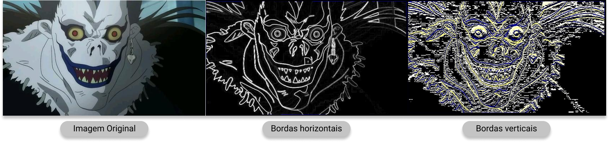
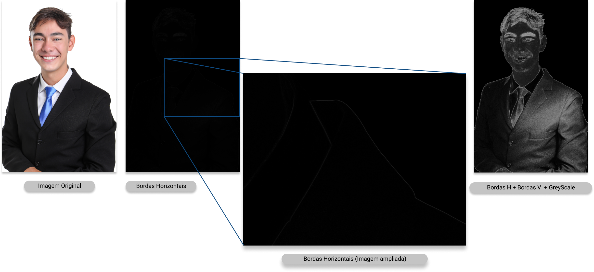
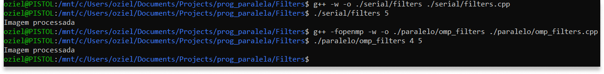
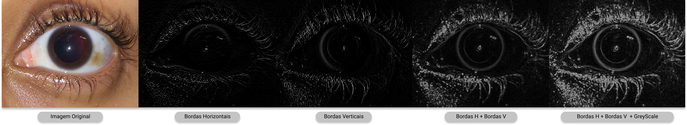
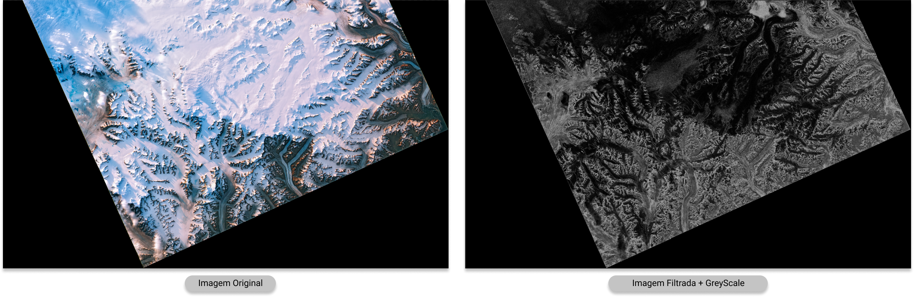
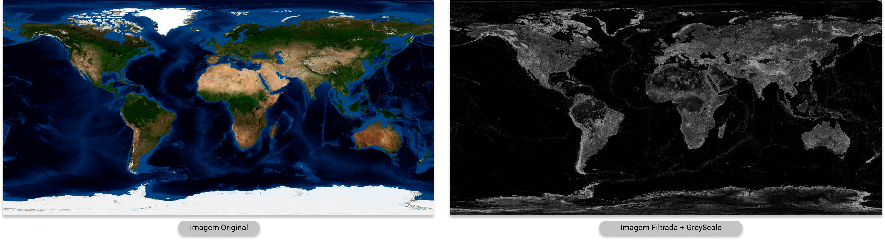
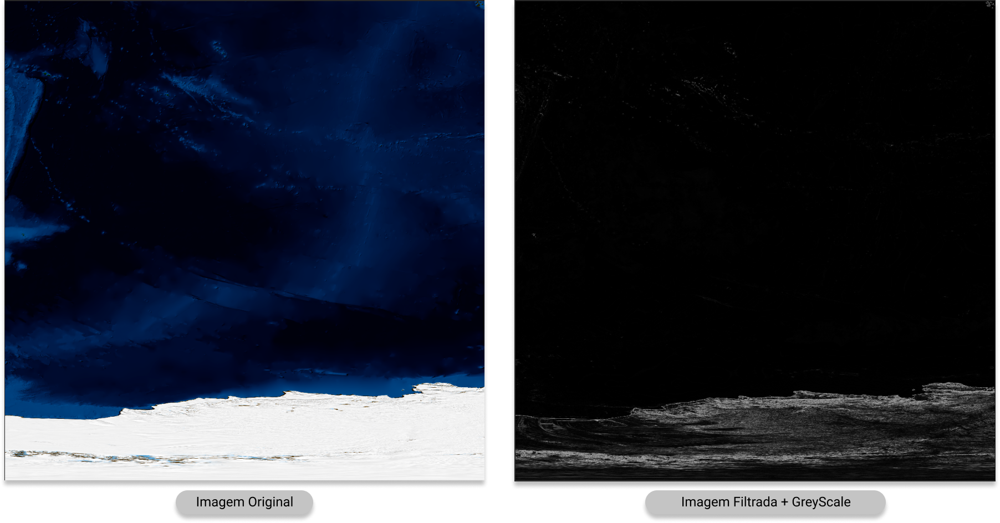
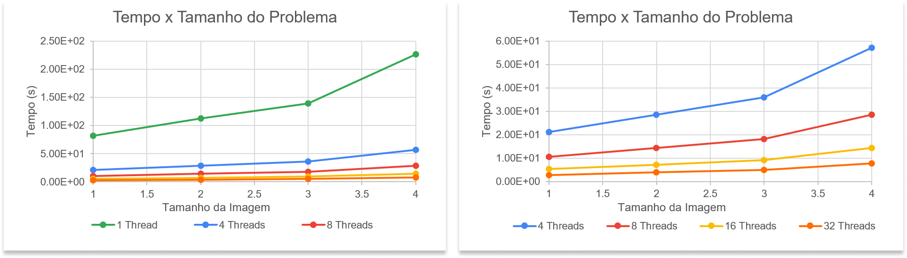
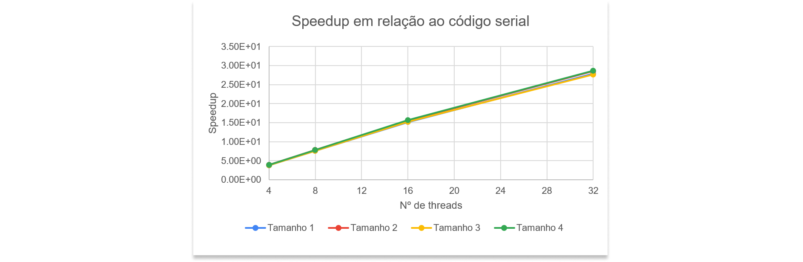
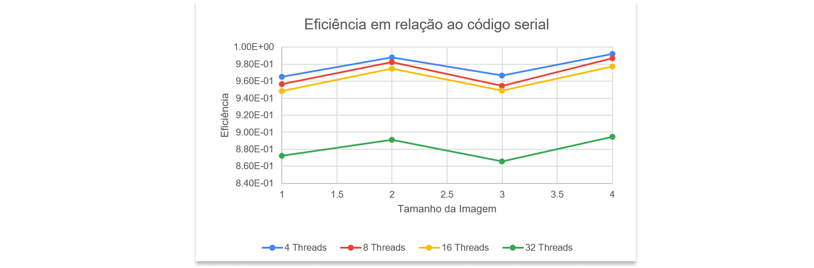

# Análise de Algoritmos Paralelos e Seriais

## Aplicação de filtros de identificação de bordas

Universidade Federal do Rio Grande do Norte ([UFRN](http://http://www.ufrn.br)), 2020.

Análise por: [Oziel Alves](https://github.com/ozielalves/)


Esta análise se encontra disponível em:

`https://github.com/ozielalves/prog-paralela/tree/master/Filters`

## Sumário

- [Introdução](#introdução)
  - [Objetivos](#objetivos)
  - [Dependência](#dependência)
    - [G++ Compiler](#g-compiler)
  - [Compilação e Execução](#compilação-e-execução)
  - [Arquivo com Resultados](#arquivo-com-resultados)
  - [Condições de Testes](#condições-de-testes)
    - [Informações sobre a máquina utilizada](#informações-sobre-a-máquina-utilizada)
  - [Apresentação do Algoritmo](#apresentação-do-algoritmo)
    - [Aplicação de filtros de identificação de bordas](#aplicação-de-filtros-de-identificação-de-bordas)
    - [Código serial](#código-serial)
    - [Código paralelo](#código-paralelo)
- [Desenvolvimento](#desenvolvimento)
  - [Conversão das imagens](#conversão-das-imagens)
  - [Uso da escala de cinzas](#uso-da-escala-de-cinzas)
  - [Corretude](#corretude)
  - [Apresentação dos resultados](#apresentação-dos-resultados)
  - [Gráficos](#gráficos)
  - [Análise de Speedup](#análise-de-speedup)
  - [Análise de Eficiência](#análise-de-eficiência)
- [Conclusão](#conclusão)
  - [Considerações Finais](#considerações-finais)
  - [Softwares utilizados](#softwares-utilizados)

<!-- <br>
<br>
<br>
<br>
<br> -->

## Introdução

### Objetivos

Esta análise tem como propósito a avaliação do comportamento de um código referente a um algoritmo de **aplicação de filtros de identificação de bordas** em imagens `.ppm`, implementado serial e paralelamente. Serão destacados o speedup e a eficiência do código paralelo em relação ao serial, levando em consideração diferentes tamanhos de problema para composição dos resultados finais da análise. Testes serão feitos com 1 (serial), 4, 8, 16 e 32 threads, e os tamanhos de problema serão definidos empiricamente com o objetivo de superar o tempo mínimo de execução determinado pela [referência](https://github.com/ozielalves/prog-paralela/tree/master/referencia) desta análise.

### Dependência

#### G++ Compiler

É necessário para a compilação dos programas visto que são feitos em c++.

```bash
# Instalação no Ubuntu 20.04 LTS:
sudo apt-get install g++
```

### Compilação e Execução

Instalada a dependência, basta executar o shellscript determinado para a devida bateria de execuções na raiz do repositório:<br>
Serão realizadas **10 execuções** com **4 tamanhos de problema** , em **5 quantidades de threads** (1, 4, 8, 16 e 32).

```bash
# Para o algoritmo serial de produção do histograma
./filters_start.sh
```

```bash
# Para o algoritmo paralelo de produção do histograma
./omp_filters_start.sh
```

**Obs.:** Caso seja necessário conceder permissão máxima para os scripts, execute `chmod 777 [NOME DO SCRIPT].sh`.

### Arquivo com Resultados

Após o termino das execuções do script é possível ter acesso aos arquivos contendo os tempos de execução, `.txt`, e também às imagens resultado, em formatos `.ppm` e `.pgm`, nas pastas `serial` ou `paralelo`, de acordo com o script executado.

### Condições de Testes

#### Informações sobre a máquina utilizada

- **Supercomputador (UFRN) - Nó computacional em lâmina**

- **Processador**: 2 x CPU Intel Xeon Sixteen-Core E5-2698v3 de 2.3 GHz/40M cache/ 9.6 GT/s

- **Número de Cores/Threads**: 32/32

- **Memória**: 128 GB tipo DDR4 – 2133MHz RDIMM (8 x 16GB)

- **Sistema**: Centos 6.5 x86_64

<!-- <br>
<br> -->

### **Apresentação do Algoritmo**

#### Aplicação de filtros de identificação de bordas

A detecção de bordas é uma técnica de processamento de imagem e visão computacional para determinar pontos de uma imagem digital em que a intensidade luminosa muda repentinamente. Mudanças repentinas em imagens geralmente refletem eventos importantes no cenário, como a descontinuidade da profundidade (transição entre o objeto e o fundo), descontinuidade da orientação da superfície, mudança das propriedades do material ou variações na iluminação da cena.

A detecção de borda é amplamente usada na extração de características da imagem. Sua utilização reduz significativamente a quantidade de dados a serem processados, e descarta informações que são consideradas menos relevantes, ainda que preservando importantes propriedades estruturais de uma figura. A detecção pode ser prejudicada por bordas falsas criadas por ruídos (provenientes da digitalização, compressão ou através do próprio processo de captura da imagem). Isso pode ser amenizado ao utilizar alguma técnica de redução de ruído antes da detecção de borda.

Para a detecção de bordas, os operadores gradiente - em x, `Gx`, e em y, `Gy` - são aplicados em uma função, `f(x,y)`, que representa o nível de cor em uma determinada coordenada da imagem. Dado que as cores na imagem são conhecidas apenas pixel a pixel (ou seja, de maneira discreta), o gradiente aplicado é o discretizado. Essa aplicação é feita por meio de uma convolução das matrizes apresentadas a seguir com a função `f(x,y)`.


O gradiente na direção x é o responsável pela identificação de bordas verticais, enquanto que o na direção y, de horizontais. Por fim, as imagens obtidas a partir da aplicação dos dois são combinadas aplicando-se a seguinte equação, onde `F(x,y)` representa a imagem filtrada:

`F(x,y) = sqrt((Gx * f(x,y))^2 + (Gy * f(x,y))^2)`



**Referência**: [Rhaylson Silva - Processamento de imagens: Detecção de bordas de imagens (02/03/2012)](https://rhaylsonsilva.wordpress.com/2012/03/02/processamento-de-imagens-deteccao-de-bordas-de-imagens/).

#### **Código serial**

Dada uma imagem `.ppm` a seguinte sub-rotina é implementada para aplicação dos filtros:

1. O arquivo de imagem é aberto e o método de leitura `ppmReader` da classe `ImageReaderWriter` se encarrega de ler cada pixel da matriz e retornar um objeto `myImage` de tipo `Image` com pixels de tipo `RGB`.

2. Três novas imagens, que receberão os resultados da aplicação dos filtros de detecção bordas horizontais e verticais separadamente e a junção dos dois processos são criadas e inicializadas com as mesmas informações de `myImage`.

3. A matriz `chunk`, que armazena pixels vizinhos à linha de pixels processada na iteração, é redimensionada de acordo com a largura da imagem.

4. É dado início ao processo de aplicação dos filtros de detecção linha por linha, de forma serial.

As implementações das funções `processx` e `processy`, responsáveis pela aplicação dos filtros de bordas horizontais e verticais, respectivamente, são apresentadas abaixo:

```bash
# Aplica o filtro de identificação de bordas horizontais
void processx(const vector<vector<RGB>> chunk, vector<RGB> &pixelout, unsigned colunas)
{
    unsigned i, j, k; # Variáveis axiliares
    int kernel[3][3] = {{1, 2, 1}, {0, 0, 0}, {-1, -2, -1}};

    for (k = 1; k < colunas - 1; k++)
    {
        pixelout[k].r = 0;
        for (i = 0; i < 3; i++)
        {
            for (j = 0; j < 3; j++)
            {
                pixelout[k].r += chunk[i][k + j - 1].r * kernel[i][j];
            }
        }
        pixelout[k].g = pixelout[k].r;
        pixelout[k].b = pixelout[k].r;
    }
}

# Aplica o filtro de identificação de bordas verticais
void processy(const vector<vector<RGB>> chunk, vector<RGB> &pixelout, unsigned colunas)
{
    unsigned i, j, k; # Variáveis axiliares
    int kernel[3][3] = {{1, 0, -1}, {2, 0, -2}, {1, 0, -1}};
    for (k = 1; k < colunas - 1; k++)
    {
        pixelout[k].r = 0;
        for (i = 0; i < 3; i++)
        {
            for (j = 0; j < 3; j++)
            {
                pixelout[k].r += chunk[i][k + j - 1].r * kernel[i][j];
            }
        }
        pixelout[k].g = pixelout[k].r;
        pixelout[k].b = pixelout[k].r;
    }
}
```

#### **Código paralelo**

Para aplicação dos filtros de forma paralela, uma sub-rotina idêntica à anterior é implementada, dessa vez utilizando OpenMP.

Devido à alta abstração da biblioteca, foi possível implementar o processo paralelo de maneira simplificada, dividindo o número de linhas para aplicação dos filtros entre o número `n` de threads utilizadas. Para isso, foi utilizado `omp for` com `schedule(dynamic)`, como é possível observar na parte do código que realiza o processo paralelo abaixo:

```bash
#pragma omp parallel num_threads(n_threads) default(none) firstprivate(chunk) shared(myImage, outImagex, outImagey, outImage, colunas, linhas)
    {
        #pragma omp for schedule(dynamic)
        for (int i = 1; i < linhas - 1; i++)
        {

            for (int k = i - 1; k <= i + 1; k++)
            {
                for (int l = 0; l < colunas; l++)
                {
                    chunk[k - i + 1][l] = myImage.pixels[k][l];
                }
            }
            {
                processx(chunk, outImagex.pixels[i], colunas);
                processy(chunk, outImagey.pixels[i], colunas);
            }
            {
                join(outImagex.pixels[i], outImagey.pixels[i], outImage.pixels[i], colunas);
            }
        }
    }

```

<!-- <br>
<br>
<br>
<br>
<br>
<br>
<br>
<br>
<br>
<br>
<br>
<br>
<br>
<br>
<br>
<br>
<br>
<br>
<br>
<br>
<br>
<br>
<br>
<br>
<br>
<br> -->

## Desenvolvimento

Para esta análise, foram realizadas **10 execuções** para **4 imagens** em **5 quantidades de threads** (1, 4, 8, 16 e 32). As imagens escolhidas foram retiradas do banco de imagens da [NASA](https://visibleearth.nasa.gov/images/73751/july-blue-marble-next-generation-w-topography-and-bathymetry) e possuem em sequência **17082 x 10295** Pixels, **21600 x 10800** Pixels, **17291 x 17291** Pixels e **21600 x 21600** Pixels. Espera-se que o código paralelo consiga valores de speedup relevantes em relação ao tempo de execução para o código serial. Além disso, também é esperado que a eficiência do algoritmo paralelo, quanto à aplicação dos filtros, apresente valores parecidos para as demais quantidades de threads utilizadas quando é aumentado somente o tamanho do problema. Uma descrição completa da máquina de testes pode ser encontrada no tópico [Condições de Testes](#condições-de-testes).

### **Conversão das imagens**

O programa desenvolvido tem como objetivo a aplicação de filtros de detecção de bordas em imagens de formato `.ppm`. Por este motivo, as imagens utilizadas nesta análise foram convertidas do seu formato de origem para o formato **PPM P6** através do _GNU Image Manipulator Program_ (GIMP), em seguida, convertidas para o formato **PPM P3** (formato aceito) através de um conversor de imagens `.ppm` disponível [neste repositório](https://github.com/zowiehi/ppm-converter).

### **Uso da escala de cinzas**



Após analisar alguns resultados obtidos a partir da execução do algoritmo para imagens maiores (em termos de número de pixels), foi possível perceber que o destaque das bordas se torna pouco perceptível à medida em que é aumentado o número de pixels na imagem. Para solucionar este problema e trazer clareza à validação dos resultados, foi impressa outra imagem resultado da transformação imagem final (originalmente em RGB) em escala de cinzas.

### **Corretude**

Para validar a corretude do algoritmo implementado foi realizado uma execução para cada código em máquina local utilizando uma imagem teste com **610 x 180** pixels para o código serial e para o código paralelo (4 Threads).



Ambos os códigos executaram a a aplicação dos filtros de detecção de bordas na imagem teste com sucesso. As imagens de saída pós execução estão apresentadas abaixo.



<!-- <br> -->

### **Apresentação dos resultados**

Após a execução dos códigos foi possível recuperar 4 imagens _output_ para cada imagem filtrada. Abaixo é possível observar uma comparação entre as imagens originais e as imagens geradas após a detecção de bordas.

#### **Imagem 1 (17082 x 10295)**



<!-- <br>
<br>
<br>
<br>
<br>
<br> -->

#### **Imagem 2 (21600 x 10800)**



#### **Imagem 3 (17291 x 17291) e 4 (21600 x 21600)**



**Obs.:** As imagens 3 e 4 são idênticas, alterando apenas o número de pixels.

<!-- <br>
<br>
<br> -->

### **Gráficos**



De maneira perceptível o código paralelo consegue diminuir o tempo de execução do algoritmo para todos os tamanhos de problema quando aumentado o número de threads utilizadas.

### **Análise de Speedup**

É possível definir o _speedup_, quando da utilização de `n` threads, como sendo o tempo médio de execução do código serial dividido pelo tempo médio de execução para `n` threads em um dado tamanho de problema. Dessa forma, o speedup representa um aumento médio de velocidade na resolução dos problemas. No gráfico abaixo é possível perceber de maneira mais clara o que acontece com o speedup do código paralelo quando aumentado o número de threads em utilização.



Como era esperado, existe uma manutenção do speedup conforme é aumentado o número de threads em execução.<br><br>

A tabela abaixo apresenta uma relação mais detalhada do speedup obtido quando comparada a execução do código paralelo - usando os difentes números de threads - com a execução do código serial, para os mesmos tamanhos de problema.

| Threads | Imagem | Speedup  |
| ------- | ------ | -------- |
| 4       | 1      | 3.86E+00 |
| 4       | 2      | 3.95E+00 |
| 4       | 3      | 3.87E+00 |
| 4       | 4      | 3.97E+00 |
| 8       | 1      | 7.65E+00 |
| 8       | 2      | 7.86E+00 |
| 8       | 3      | 7.64E+00 |
| 8       | 4      | 7.90E+00 |
| 16      | 1      | 1.52E+01 |
| 16      | 2      | 1.56E+01 |
| 16      | 3      | 1.52E+01 |
| 16      | 4      | 1.56E+01 |
| 32      | 1      | 2.79E+01 |
| 32      | 2      | 2.85E+01 |
| 32      | 3      | 2.77E+01 |
| 32      | 4      | 2.86E+01 |

### **Análise de Eficiência**

Através do cálculo do speedup, é possível obter a eficiência do algoritmo quando executado com as diferentes quantidades de threads. Este cálculo pode ser realizado através da divisão do speedup do algoritmo utilizando `n` threads pelo número `n` de threads utilizados. O gráfico abaixo destaca o comportamento da eficiência do código paralelo quando executado utilizando 4, 8, 16 e 32 threads.



A maneira como se comportam as linhas que representam a eficiência para todas as quantidades de threads permite classificar o algoritmo analisado como **escalável**. Isto é, quando a eficiência aumenta ou permanece constante quando aumentado o tamanho de problema e o número de threads em utilização.

A tabela abaixo apresenta de maneira mais detalhada a eficiência calculada através dos valores de speedup anteriormente fornecidos.

| Threads | Imagem | Eficiência |
| ------- | ------ | ---------- |
| 4       | 1      | 9.65E-01   |
| 4       | 2      | 9.88E-01   |
| 4       | 3      | 9.67E-01   |
| 4       | 4      | 9.92E-01   |
| 8       | 1      | 9.57E-01   |
| 8       | 2      | 9.82E-01   |
| 8       | 3      | 9.55E-01   |
| 8       | 4      | 9.87E-01   |
| 16      | 1      | 9.49E-01   |
| 16      | 2      | 9.75E-01   |
| 16      | 3      | 9.49E-01   |
| 16      | 4      | 9.77E-01   |
| 32      | 1      | 8.72E-01   |
| 32      | 2      | 8.91E-01   |
| 32      | 3      | 8.66E-01   |
| 32      | 4      | 8.94E-01   |

<!-- <br>
<br> -->

## **Conclusão**

### Considerações Finais

O uso da API **OpenMP** trouxe fluidez ao processo de desenvolvimento dos códigos quando permitiu uma transição sem muitas modificações na sub-rotina do processo serial para o processo paralelo. No decorrer da análise, foi interessante perceber a disparidade no tempo de execução quando alternada a maneira como o OpenMP distribuia as fatias de problema entre as threads. Das schedules testadas para o `omp for`, a schedule `dynamic` foi a que obteve melhores resultados.

É importante perceber que a transformação para escala de cinzas é uma área do código serial que poderia ter sido paralelizada. No entanto, por não fazer parte do objetivo do algoritmo, este trecho de código foi utilizando com a única finalidade de trazer clareza à validação dos resultados.

O código paralelo demonstrou uma eficiencia bastante satisfatória em relação ao código serial. De acordo com o comportamento da eficiência em relação ao aumento no tamanho do problema e no número de threads em execução (não necessariamente seguindo a mesma proporção), foi possível classificar o algoritmo de detecção de bordas horizontais e verticais como **escalável**.

<br>

### **Softwares utilizados**

```bash
~$: g++ --version
g++ (Ubuntu 9.3.0-17ubuntu1~20.04) 9.3.0
Copyright (C) 2019 Free Software Foundation, Inc.
This is free software; see the source for copying conditions.  There is NO
warranty; not even for MERCHANTABILITY or FITNESS FOR A PARTICULAR PURPOSE.
```

```bash
~$: python3 --version
Python 3.8.5
```

```bash
~$: grip --version
Grip 4.5.2
```

```bash
Photoshop 2019
```

```bash
GIMP 2.10.22
```
