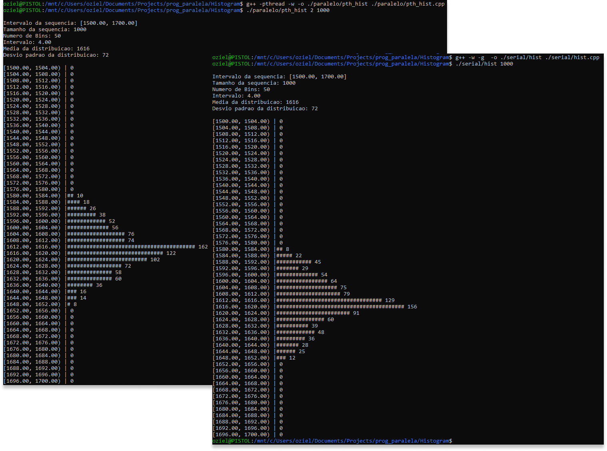
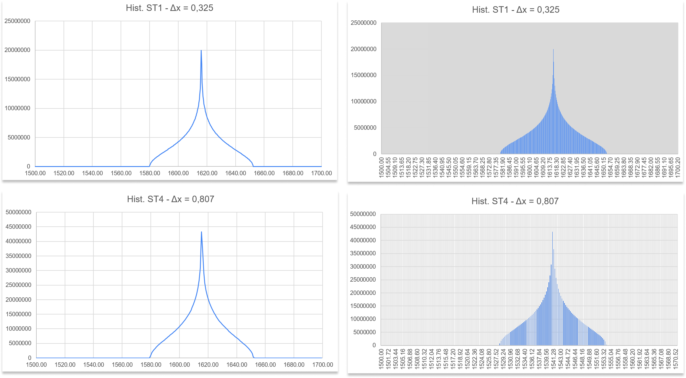
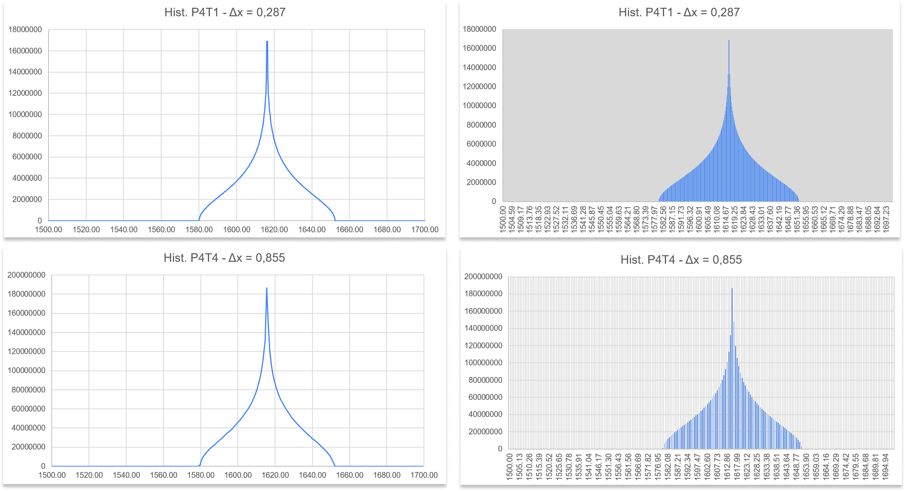
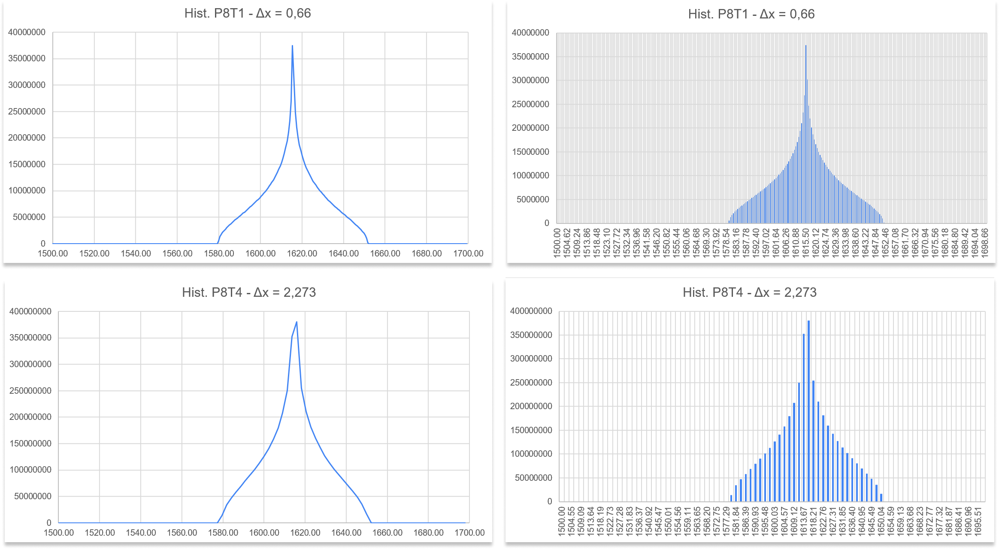
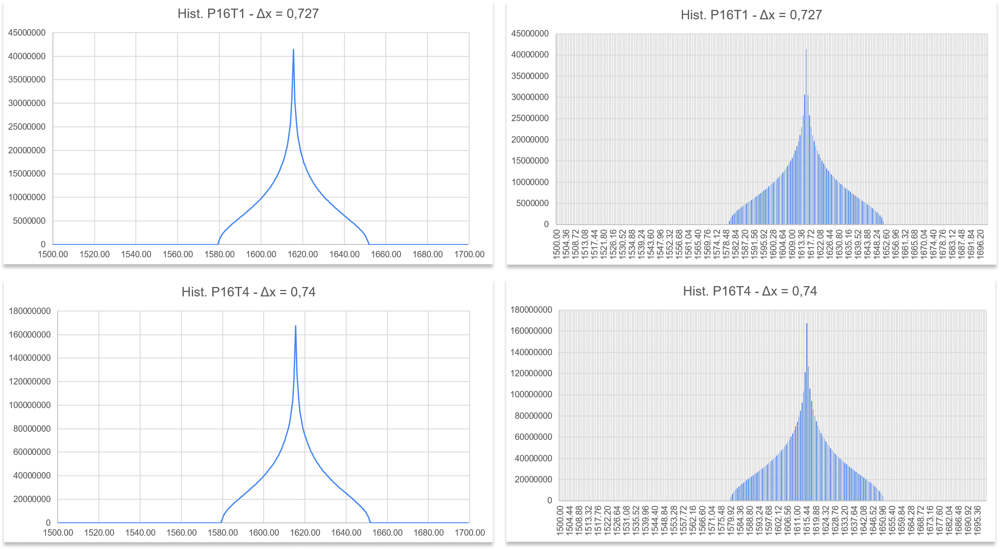
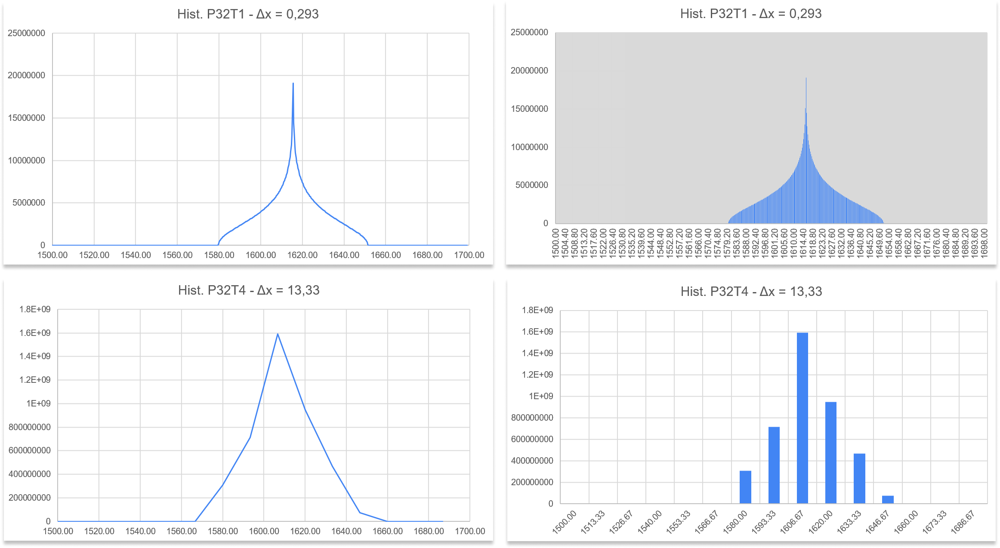
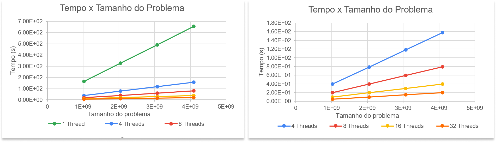
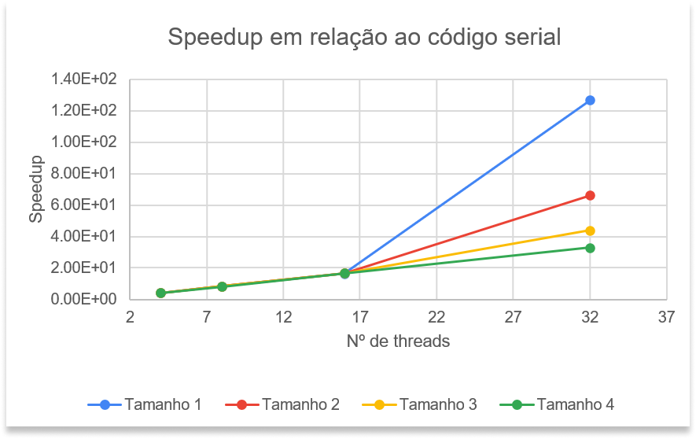
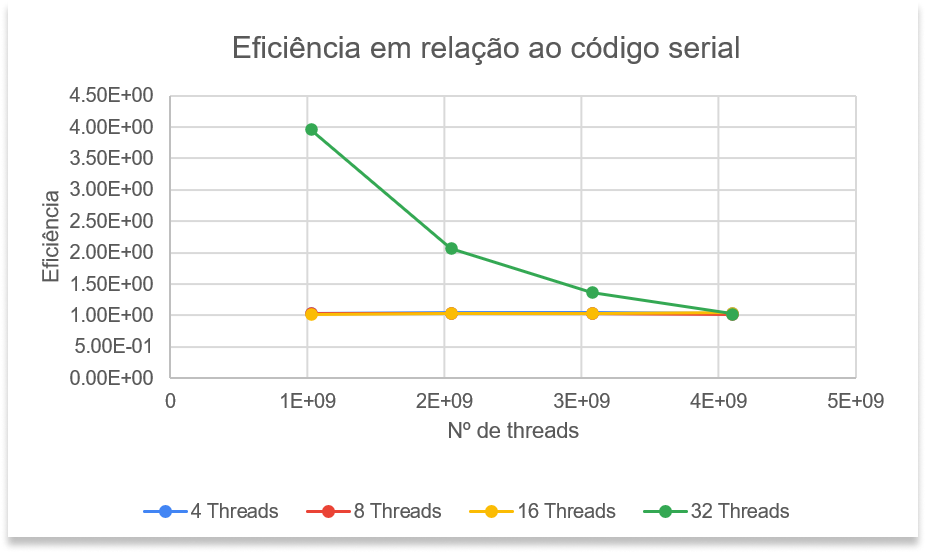

# Análise de Algoritmos Paralelos e Seriais

## Cálculo de Histograma

Universidade Federal do Rio Grande do Norte ([UFRN](http://http://www.ufrn.br)), 2020.

Análise por:

[Oziel Alves](https://github.com/ozielalves/)

Esta análise se encontra disponível em:

`https://github.com/ozielalves/prog-paralela/tree/master/Histogram`

## Sumário

- [Introdução](#introdução)
  - [Objetivos](#objetivos)
  - [Dependência](#dependência)
    - [G++ Compiler](#g-compiler)
  - [Compilação e Execução](#compilação-e-execução)
  - [Arquivo com Resultados](#arquivo-com-resultados)
  - [Condições de Testes](#condições-de-testes)
    - [Informações sobre a máquina utilizada](#informações-sobre-a-máquina-utilizada)
  - [Apresentação do Algoritmo](#apresentação-do-algoritmo)
    - [Cálculo de histograma](#cálculo-do-histograma)
    - [Modelo de distribuição](#modelo-de-distribuição)
    - [Código serial](#código-serial)
    - [Código paralelo](#código-paralelo)
- [Desenvolvimento](#desenvolvimento)
  - [Corretude](#corretude)
  - [Histogramas](#histogramas)
  - [Gráficos](#gráficos)
  - [Análise de Speedup](#análise-de-speedup)
  - [Análise de Eficiência](#análise-de-eficiência)
- [Conclusão](#conclusão)
  - [Considerações Finais](#considerações-finais)
  - [Softwares utilizados](#softwares-utilizados)

<!-- <br>
<br>
<br>
<br>
<br>
<br>
<br>
<br> -->

## Introdução

### Objetivos

Esta análise tem como propósito a avaliação do comportamento de um código serial e um código paralelo referentes a implementação do algoritmo de produção de **histograma** para geração de números utilizando um modelo de distruibuição inspirado na **distribuição gaussiana** (normal). Será destacado o speedud e a eficiência do código paralelo em relação ao código serial, levando em consideração os tempos de execução e tamanhos de problema para composição dos resultados finais da análise. Os cenários irão simular a execução dos programas para 1 (serial), 4, 8, 16 e 32 threads, com 4 tamanhos de problema, definidos empiricamente com o objetivo de atingir o tempo mínimo de execução determinado pela [referência](https://github.com/ozielalves/prog-paralela/tree/master/referencia) desta análise para os limites do intervalo de tamanhos.

### Dependência

#### G++ Compiler

É necessário para a compilação dos programam, visto que são feitos em c++.

```bash
# Instalação no Ubuntu 20.04 LTS:
sudo apt-get install g++
```

### Compilação e Execução

Instalada a dependência, basta executar o shellscript determinado para a devida bateria de execuções na raiz do repositório:<br>
Serão realizadas **10 execuções** com **4 tamanhos de problema** , em **5 quantidades de threads** (1, 4, 8, 16 e 32).

```bash
# Para o algoritmo serial de produção do histograma
./hist_start.sh
```

```bash
# Para o algoritmo paralelo de produção do histograma
./pth_hist_start.sh
```

**Obs.:** Caso seja necessário conceder permissão máxima para os scripts, execute `chmod 777 [NOME DO SCRIPT].sh`.

### Arquivo com Resultados

Após o termino das execuções do script é possível ter acesso aos arquivos de tempo `.txt` na pasta `serial` ou `paralelo`, de acordo com o script executado. Os resultantes da execução desses scripts foram utilizados para realização desta análise.

### Condições de Testes

#### Informações sobre a máquina utilizada

- **Supercomputador (UFRN) - Nó computacional em lâmina**

- **Processador**: 2 x CPU Intel Xeon Sixteen-Core E5-2698v3 de 2.3 GHz/40M cache/ 9.6 GT/s

- **Número de Cores/Threads**: 32/32

- **Memória**: 128 GB tipo DDR4 – 2133MHz RDIMM (8 x 16GB)

- **Sistema**: Centos 6.5 x86_64

### **Apresentação do Algoritmo**

#### Cálculo do histograma

O histograma, também conhecido como distribuição de frequências, é a representação gráfica em colunas ou em barras (bins) de um conjunto de dados previamente tabulado e dividido em classes uniformes ou não uniformes. A base de cada retângulo representa uma classe. A altura de cada retângulo representa a quantidade ou a frequência absoluta com que o valor da classe ocorre no conjunto de dados para classes uniformes ou a densidade de frequência para classes não uniformes.

Ambos os algoritmos desenvolvidos tem o propósito de clusterizar **n** números, gerados utilizando o modelo de distruibuição implementado, em uma quantidade de grupos(bins) randômica, em um intervalo definido empiricamente com base nos limites da distribuição utilizada. A imagem abaixo demonstra simbolicamente a representação gráfica de um histograma qualquer.


**Referência**: Zvirtes, Leandro. Ferramentas da Qualidade. p. 2.

#### **Modelo de distruibuição**

A implementação do modelo tem por objetivo a concentração de 100% dos valores gerados dentro do intervalo definido para a análise.

```bash
# Valores próximos a média são mais prováveis
# O desvio padrão afeta a dispersão de valores gerados pela média
float newDistribution(int mean, int standard_deviation)
{

    float r, v1, v2, random_number;

    r = 2;
    while (r >= 1)
    {
        v1 = (2 * ((float)rand() / (float)RAND_MAX) - 1);
        v2 = (2 * ((float)rand() / (float)RAND_MAX) - 1);
        r = (v1 * v1) + (v2 * v2);
    }

    r = sqrt(-2 * log(r) / r);

    random_number = mean + standard_deviation * v1 * v2;

    return (random_number);
}
```

#### **Código serial**

Dado um número `n` de números a serem gerados e categorizados, a seguinte sub-rotina é implementada:

1. `n_numbers` recebe o valor de `n` passado.

2. O número de bins `n_bins` é gerado randomicamente.

3. A partir de valores de intervalo máximo e mínimo, previamente determinados, e do número de bins, é então calculado o intervalo entre cada bin.

4. Posteriormente, é alocado espaço para o array `histograma` que armazenará a contagem de números gerados por bins.

5. Em seguida são atribuídos os dados do histograma a ser calculado à _Struct_ `arg`.

A implementação da função `HIST` é apresentada abaixo:

```bash
# Calcula um histograma com base em um bloco de números
void HIST(histogram_data arg)
{
    unsigned long long i; # Variável auxiliar
    float num;            # Número randômico gerado (Distribuição implementada)
    int bin_index;        # Identificador de bin


    # Determina seed dinâmica para geração de números
    srand((unsigned int)(time(NULL)));

    for (i = 0; i < arg.n_numbers; i++)
    {
        num = gaussDistribution(arg.mean, arg.standard_deviation);
        bin_index = floor((num - arg.min) / arg.interval);
        histogram[bin_index] += 1;
    }
}
```

#### **Código paralelo**

Ainda sendo `n` a quantidade de números a serem gerados e categorizados, uma sub-rotina similar a anterior é implementada:

1. `n_numbers` recebe o valor de `n` passado. e `n_threads` recebe o número de threads que serão utilizados nesta execução.

2. O número de bins `n_bins` é gerado randomicamente.

3. A partir de valores de intervalo máximo e mínimo, previamente determinados, e do número de bins, é então calculado o intervalo entre cada bin.

4. `local_n_numbers` recebe a fração de números que cada thread será responsável por gerar e categorizar.

5. O semáforo da execução paralela é inicializado permitindo a entrada de apenas 1 thread por vez na área crítica.

6. O vetor de threads é alocado de acordo com o número de threads `n_threads` fornecido.

7. O array de dados do histograma `args`, de tipo _histogram_data_, é alocado de acordo com o número de threads fornecidos para a execução.

8. Posteriormente, é alocado espaço para o array `histograma` que armazenará a contagem de números gerados por bins.

9. Em seguida, é dado início a parte paralela do algoritmo. Porém, antes que seja chamada a função `PTH_HIST`, em cada thread, são atribuídos os dados da fatia de histograma a ser calculado no array de dados `args` de acordo com o id da thread.

A implementação da função `PTH_HIST` é apresentada abaixo:

```bash
# Calcula um histograma com base em um bloco de números
void *PTH_HIST(void *hist_numbers_arr)
{
    histogram_data *arg = (histogram_data *)hist_numbers_arr;
    unsigned long long i; # Variável auxiliar
    float num;            # Número gerado randomicamente (Distribuição implementada)
    int bin_index;        # Identificador do bin

    # Determina seed dinâmica para geração de números
    SEED = (unsigned int)(time(NULL));

    # Alloca espaço para o histograma local (Array)
    int *local_histogram = (int *)calloc(arg->n_bins, sizeof(int));

    # Calcula o histograma para o bloco de dados
    for (i = 0; i < arg->n_numbers; i++)
    {
        num = gaussDistribution(arg->mean, arg->standard_deviation);
        bin_index = floor((num - arg->min) / arg->interval);
        local_histogram[bin_index] += 1;
    }

    /************************ INÍCIO DA ÁREA CRÍTICA ************************/

    sem_wait(&semaphore);

    for (i = 0; i < (arg->n_bins); ++i)
    {
        histogram[i] += local_histogram[i];
    }

    sem_post(&semaphore);

    /************************** FIM DA ÁREA CRÍTICA **************************/

    free(local_histogram);
}
```

**Obs.:** Por fim de segurança no processo paralelo foi utilizada a função `rand_r()` em substituição à função `rand()` utilizada no código paralelo para geração de números randômicos.

## Desenvolvimento

Para esta análise, foram realizadas **10 execuções** com tamanhos de problema **1.024.000.000**, **2.048.000.000**, **3.072.000.000** e **4.096.000.000**, em **5 quantidades de threads** (1, 4, 8, 16 e 32). Como limites de intervalo mínimo e máximo foram selecionados respectivamente **1.500** e **1.700**, de modo a cobrir todos os números gerados pela distruibuição implementada, foi utilizado **1616** como média de distruição e desvio padrão de **72**. O número de bins será definido randomicamente em tempo de execução, como requisito destacado na [referência desta análise](https://github.com/ozielalves/prog-paralela/tree/master/referencia). Se espera que o código paralelo consiga valores de speedup relevantes em relação ao tempo de execução para o código serial. Além disso, também é esperado que a eficiência do algoritmo paralelo, quanto ao cálculo do histograma, apresente valores parecidos para as demais quantidades de threads utilizadas quando é aumentado somente o tamanho do problema. Uma descrição completa da máquina de testes pode ser encontrada no tópico [Condições de Testes](#condições-de-testes).

### **Corretude**

Para validar a corretude dos algoritmos implementados foi realizado um teste em máquina local, foi utilizado **1000** como tamanho de problema para o código serial e para o código paralelo (2 Threads). Note que foi fixado o número de bins em **50** para que pudesse haver uma comparação apropriada entre os dois códigos e uma impressão visível em tela.



Como é possível perceber através dos prints de execução em terminal, ambos os códigos calculam o histograma com precisão, é possível observar ainda que os histogramas gerados obedecem um padrão de estrutura que se assemelha à **distruibuição gaussiana**, quando valores proximos a média de distribuição são mais prováveis.<br><br>

### **Histogramas**

Após a execução dos códigos foi possível recuperar os dados referentes a cada histograma gerado, alguns dos histogramas coletados serão apresentados abaixo.

#### Serial



#### Paralelo - 4 Threads



#### Paralelo - 8 Threads



#### Paralelo - 16 Threads



#### Paralelo - 32 Threads



### **Gráficos**



De maneira perceptível o código paralelo consegue diminuir o tempo de execução do algoritmo para todos os tamanhos de problema quando aumentado o número de threads utilizadas.

### **Análise de Speedup**

É possível definir o _speedup_, quando da utilização de `n` threads, como sendo o tempo médio de execução no código serial dividido pelo tempo médio de execução para `n` threads em um dado tamanho de problema. Dessa forma, o speedup representa um aumento médio de velocidade na resolução dos problemas. No gráfico abaixo é possível perceber de maneira mais clara o que acontece com o speedup do código paralelo quando aumentado o número de threads em utilização.



A forma como as linhas do gráfico assumem um comportamento diferente a partir do uso de 16 threads demonstra a relação inversamente proporcional existente entre o tamanho do problema e o speedup relativo por quantidade de threads em execução. Ou seja, quanto mais próximo do número de threads for a quantidade de números que cada thread terá que gerar e classificar, mais rápida será a execução do programa.<br><br>

A tabela abaixo apresenta uma relação mais detalhada do speedup obtido quando comparada a execução do código paralelo - com 4 números de threads - com a execução do código serial, com os mesmos tamanhos de problema.

| Cores | Tamanho do Problema | Speedup  |
| ----- | ------------------- | -------- |
| 4     | 1024000000          | 4.14E+00 |
| 4     | 2048000000          | 4.16E+00 |
| 4     | 3072000000          | 4.16E+00 |
| 4     | 4096000000          | 4.14E+00 |
| 8     | 1024000000          | 8.28E+00 |
| 8     | 2048000000          | 8.29E+00 |
| 8     | 3072000000          | 8.28E+00 |
| 8     | 4096000000          | 8.23E+00 |
| 16    | 1024000000          | 1.65E+01 |
| 16    | 2048000000          | 1.66E+01 |
| 16    | 3072000000          | 1.66E+01 |
| 16    | 4096000000          | 1.66E+01 |
| 32    | 1024000000          | 1.27E+02 |
| 32    | 2048000000          | 6.63E+01 |
| 32    | 3072000000          | 4.38E+01 |
| 32    | 4096000000          | 3.29E+01 |

### **Análise de Eficiência**

Através do cálculo do speedup, é possível obter a eficiência do algoritmo quando submetido a execução com as diferentes quantidades de threads. Este cálculo pode ser realizado através da divisão do speedup do algoritmo utilizando `n` threads pelo número `n` de threads utilizados. O gráfico abaixo destaca o comportamento da eficiência do código paralelo quando executado utilizando 4, 8, 16 e 32 threads.



Observando as linhas que representam a eficiência para todas as quantidades de threads, é possível identificar uma manutenção da eficiência para um mesmo tamanho de problema conforme aumentamos somente o número de threads. Para **32 threads**, em especial, é possível identificar uma queda na eficiência conforme aumentado o tamanho do problema. Todavia, vale salientar o grande aumento da eficiência de maneira inversamente proporcional ao crescimento do problema para esta quantidade, para os 3 primeiros tamanhos de problema, a eficiência em 32 threads ficou acima da média se comparada às demais quantidades de threads. Apesar da redução da eficiência para 32 threads, conforme aumentado o tamanho do problema, a linha que representa a eficiência para esta quantidade de threads tende a se estabilzar no gráfico em valores bem próximos aos observados para as outras quantidades de threads. Em consequência disto, é possível definir o algoritmo paralelo como **fortemente escalável** quando comparado ao algoritmo serial resolve o mesmo problema.<br>

A tabela abaixo apresenta de maneira mais detalahda a eficiência calculada através dos valores de speedup anteriormente fornecidos.

| Cores | Tamanho do Problema | Eficiência |
| ----- | ------------------- | ---------- |
| 4     | 1024000000          | 1.04E+00   |
| 4     | 2048000000          | 1.04E+00   |
| 4     | 3072000000          | 1.04E+00   |
| 4     | 4096000000          | 1.04E+00   |
| 8     | 1024000000          | 1.04E+00   |
| 8     | 2048000000          | 1.04E+00   |
| 8     | 3072000000          | 1.04E+00   |
| 8     | 4096000000          | 1.03E+00   |
| 16    | 1024000000          | 1.03E+00   |
| 16    | 2048000000          | 1.04E+00   |
| 16    | 3072000000          | 1.04E+00   |
| 16    | 4096000000          | 1.04E+00   |
| 32    | 1024000000          | 3.96E+00   |
| 32    | 2048000000          | 2.07E+00   |
| 32    | 3072000000          | 1.37E+00   |
| 32    | 4096000000          | 1.03E+00   |

## **Conclusão**

### Considerações Finais

Por meio dos resultados coletados após a execução de todos os códigos, foi possível obter resultados bastante satisfatórios quanto a comparação do algoritmo paralelo em relação ao código serial. O código paralelo demonstrou uma eficiencia bastante significativa em relação ao código serial, o que já era esperado. No decorrer da análise, foi interessante perceber o impacto causado pela utilização do método `rand()` no processo paralelo. Após as primeiras execuções com o modelo de aleatorização não seguro para threads foi identificado que o tempo de de execução para o código paralelo não estava reduzindo, mas aumentando, conforme incrementado o tamanho do problema e a quantidade de threads. Como solução, o método `rand()` foi substituído pelo `rand_r()` mais adequado para o uso de multiplas threads. Por fim, diante do comportamento da eficiência do código paralelo quando aumentado o número de threads para um mesmo tamanho de problema, foi possível classificar o algoritmo paralelo como **fortemente escalável**.

### **Softwares utilizados**

```bash
~$: g++ --version
g++ (Ubuntu 9.3.0-17ubuntu1~20.04) 9.3.0
Copyright (C) 2019 Free Software Foundation, Inc.
This is free software; see the source for copying conditions.  There is NO
warranty; not even for MERCHANTABILITY or FITNESS FOR A PARTICULAR PURPOSE.
```

```bash
~$: python3 --version
Python 3.8.5
```

```bash
~$: grip --version
Grip 4.5.2
```
