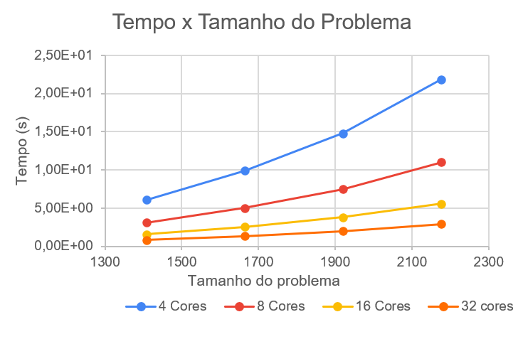
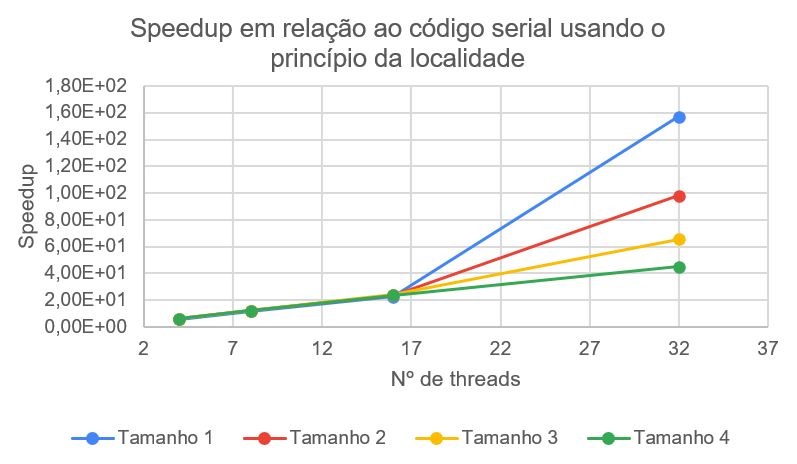
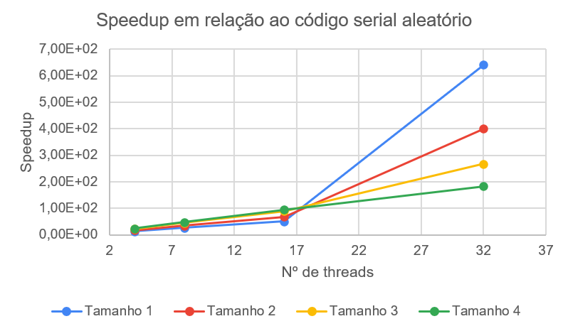
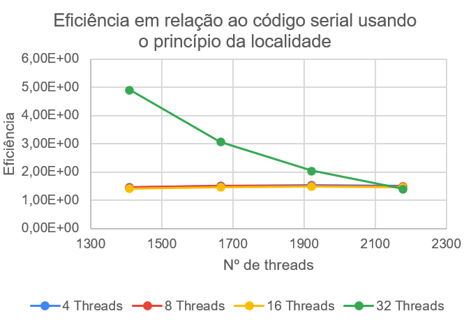
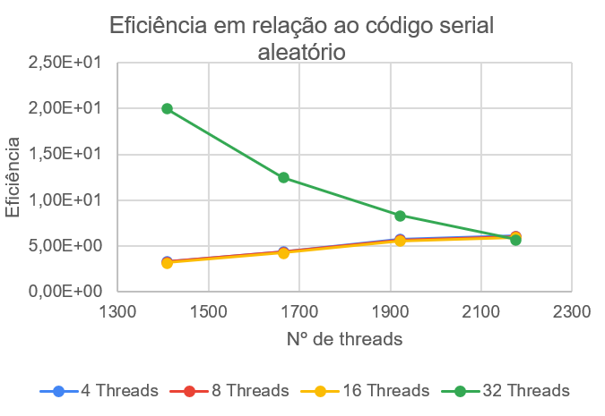

# Análise de Algoritmos Paralelos e Seriais

## Histograma - Distribuição Gaussiana

Universidade Federal do Rio Grande do Norte ([UFRN](http://http://www.ufrn.br)), 2020.

Análise por:

[Oziel Alves](https://github.com/ozielalves/)

Esta análise se encontra disponível em:

`https://github.com/ozielalves/prog-paralela/tree/master/Histogram`

## Sumário

- [Introdução](#introdução)
  - [Objetivos](#objetivos)
  - [Dependência](#dependência)
    - [G++ Compiler](#g-compiler)
  - [Compilação e Execução](#compilação-e-execução)
  - [Arquivo com Resultados](#arquivo-com-resultados)
  - [Condições de Testes](#condições-de-testes)
    - [Informações sobre a máquina utilizada](#informações-sobre-a-máquina-utilizada)
  - [Apresentação do Algoritmo](#apresentação-do-algoritmo)
    - [Multiplicação de Matrizes Quadradas](#multiplicação-de-matrizes-quadradas)
    - [**Código serial usando o princípio da localidade (01)**](#código-serial-usando-o-princípio-da-localidade-01)
    - [**Código serial com acesso de memória aleatório (02)**](#código-serial-com-acesso-de-memória-aleatório-02)
    - [**Código paralelo**](#código-paralelo)
- [Desenvolvimento](#desenvolvimento)
  - [Corretude](#corretude)
  - [Gráficos](#gráficos)
  - [Análise de Speedup](#análise-de-speedup)
  - [Análise de Eficiência](#análise-de-eficiência)
- [Conclusão](#conclusão)
  - [Considerações Finais](#considerações-finais)
  - [Softwares utilizados](#softwares-utilizados)

<br>
<br>
<br>
<br>
<br>
<br>
<br>
<br>

## Introdução

### Objetivos

Esta análise tem como propósito a avaliação do comportamento de um código seriais e um código paralelo referentes a implementação do algoritmo de produção do **histograma** para geração de números utilizando a **distribuição gaussiana** (normal). Será destacado o speedud e a eficiência do código paralelo em relação ao código serial, levando em consideração os tempos de execução e tamanhos de problema para composição dos resultados finais da análise. Os cenários irão simular a execução dos programas para 1 (serial), 4, 8, 16 e 32 threads, com 4 tamanhos de problema, definidos empiricamente com o objetivo de atingir o tempo mínimo de execução determinado pela [referência](https://github.com/ozielalves/prog-paralela/tree/master/referencia) desta análise para os limites do intervalo de tamanhos.

### Dependência

#### G++ Compiler

É necessário para a compilação dos programam, visto que são feitos em c++.

```bash
# Instalação no Ubuntu 20.04 LTS:
sudo apt-get install g++
```

### Compilação e Execução

Instalada a dependência, basta executar o shellscript determinado para a devida bateria de execuções na raiz do repositório:<br>
Serão realizadas **10 execuções** com **4 tamanhos de problema** , em **5 quantidades de threads** (1, 4, 8, 16 e 32).

```bash
# Para o algoritmo serial de produção do histograma
./hist_start.sh
```

```bash
# Para o algoritmo paralelo de produção do histograma
./pth_hist_start.sh
```

**Obs.:** Caso seja necessário conceder permissão máxima para os scripts, execute `chmod 777 [NOME DO SCRIPT].sh`.

### Arquivo com Resultados

Após o termino das execuções do script é possível ter acesso aos arquivos de tempo `.txt` na pasta `serial` ou `paralelo`, de acordo com o script executado. Os resultantes da execução desses scripts foram utilizados para realização desta análise.

### Condições de Testes

#### Informações sobre a máquina utilizada

- **Supercomputador (UFRN) - Nó computacional em lâmina**

- **Processador**: 2 x CPU Intel Xeon Sixteen-Core E5-2698v3 de 2.3 GHz/40M cache/ 9.6 GT/s

- **Número de Cores/Threads**: 32/32

- **Memória**: 128 GB tipo DDR4 – 2133MHz RDIMM (8 x 16GB)

- **Sistema**: Centos 6.5 x86_64

### Apresentação do Algoritmo

#### Produção de histograma

O histograma, também conhecido como distribuição de frequências, é a representação gráfica em colunas ou em barras (bins) de um conjunto de dados previamente tabulado e dividido em classes uniformes ou não uniformes. A base de cada retângulo representa uma classe. A altura de cada retângulo representa a quantidade ou a frequência absoluta com que o valor da classe ocorre no conjunto de dados para classes uniformes ou a densidade de frequência para classes não uniformes.

Ambos os algoritmos desenvolvidos tem o propósito de clusterizar **n** números, gerados utilizando a distribuição gaussiana, em uma quantidade de grupos(bins) randômica, em um intervalo definido empiricamente com base nos limites da distribuição utilizada. A imagem abaixo demonstra simbolicamente a representação gráfica de um histograma qualquer.


**Referência**: Zvirtes, Leandro. Ferramentas da Qualidade. p. 2.

#### **Código serial**

Dado um número `n` de números a serem gerados e categorizados, a seguinte sub-rotina é implementada:

1. `n_numbers` recebe o valor de `n` passado.

2. O número de bins(clusters) `n_bins` é gerado randomicamente.

3. A partir de valores de intervalo máximo e mínimo, previamente determinados, e do número de bins, é então calculado o intervalo entre cada bin.

4. Posteriormente, é alocado espaço para o array `histograma` que armazenará a contagem de números gerados por bins.

5. Em seguida são atribuídos os dados do histograma a ser calculado à _Struct_ `arg`.

A implementação da função `HIST` é apresentada abaixo:

```bash
# Calcula um histograma com base em um bloco de números
void HIST(histogram_data arg)
{
    unsigned long long i; # Variável auxiliar
    float num;            # Número randômico gerado (Distribuição Gaussiana)
    int bin_index;        # Identificador de bin


    # Determina seed dinâmica para geração de números
    srand((unsigned int)(time(NULL)));

    for (i = 0; i < arg.n_numbers; i++)
    {
        num = gaussDistribution(arg.mean, arg.standard_deviation);
        bin_index = floor((num - arg.min) / arg.interval);
        histogram[bin_index] += 1;
    }
}
```

#### **Código paralelo**

Ainda sendo `n` a quantidade de números a serem gerados e categorizados, uma sub-rotina similar a anterior é implementada:

1. `n_numbers` recebe o valor de `n` passado. e `n_threads` recebe o número de threads que serão utilizados nesta execução.

2. O número de bins(clusters) `n_bins` é gerado randomicamente.

3. A partir de valores de intervalo máximo e mínimo, previamente determinados, e do número de bins, é então calculado o intervalo entre cada bin.

4. `local_n_numbers` recebe a fração de números que cada thread será responsável por gerar e categorizar.

5. O semáforo da execução paralela é inicializado permitindo a entrada de apenas 1 thread por vez na área crítica.

6. O vetor de threads é alocado de acordo com o número de threads `n_threads` fornecido.

7. O array de dados do histograma `args`, de tipo _histogram_data_, é alocado de acordo com o número de threads fornecidos para a execução.

8. Posteriormente, é alocado espaço para o array `histograma` que armazenará a contagem de números gerados por bins.

9. Em seguida, é dado início a parte paralela do algoritmo. Porém, antes que seja chamada a função `PTH_HIST`, em cada thread, são atribuídos os dados da fatia de histograma a ser calculado no array de dados `args` de acordo com o id da thread.

A implementação da função `PTH_HIST` é apresentada abaixo:

```bash
# Calcula um histograma com base em um bloco de números
void *PTH_HIST(void *hist_numbers_arr)
{
    histogram_data *arg = (histogram_data *)hist_numbers_arr;
    unsigned long long i; # Variável auxiliar
    float num;            # Número gerado randomicamente (Distribuição Gaussiana)
    int bin_index;        # Identificador do bin

    # Determina seed dinâmica para geração de números
    SEED = (unsigned int)(time(NULL));

    # Alloca espaço para o histograma local (Array)
    int *local_histogram = (int *)calloc(arg->n_bins, sizeof(int));

    # Calcula o histograma para o bloco de dados
    for (i = 0; i < arg->n_numbers; i++)
    {
        num = gaussDistribution(arg->mean, arg->standard_deviation);
        bin_index = floor((num - arg->min) / arg->interval);
        local_histogram[bin_index] += 1;
    }

    /************************ INÍCIO DA ÁREA CRÍTICA ************************/

    sem_wait(&semaphore);

    for (i = 0; i < (arg->n_bins); ++i)
    {
        histogram[i] += local_histogram[i];
    }

    sem_post(&semaphore);

    /************************** FIM DA ÁREA CRÍTICA **************************/

    free(local_histogram);
}
```

**Obs.:** Para fins de segurança no processo paralelo foi utilizada a função `rand_r()` em substituição à função `rand()` utilizada no código paralelo para geração de números randômicos.

## Desenvolvimento

Para esta análise, serão realizadas **10 execuções** com tamanhos de problema **1.024.000.000**, **2.048.000.000**, **3.072.000.000** e **4.096.000.000**, em **5 quantidades de threads** (1, 4, 8, 16 e 32). Como limites de intervalo mínimo e máximo foram selecionados respectivamente **1.500** e **1.700**, de modo a cobrir todos os números gerados pela distruibuição gaussiana utilizando **1616** como média de distruição e desvio padrão de **72**, o número de bins serão definidos randomicamente em tempo de execução, como requisito destacado na [referência desta análise](https://github.com/ozielalves/prog-paralela/tree/master/referencia). Se espera que o código paralelo consiga valores de speedup relevantes em relação ao tempo de execução para o código serial. Além disso, também é esperado que a eficiência do algoritmo paralelo, quanto ao cálculo do histograma, apresente valores parecidos para as demais quantidades de threads utilizadas quando é aumentado somente o tamanho do problema. Uma descrição completa da máquina de testes pode ser encontrada no tópico [Condições de Testes](#condições-de-testes).

### Corretude

Para validar a corretude dos algoritmos implementados foi realizado um teste utilizando **1000** como tamanho de problema para o código serial e para o código paralelo. Note que foi fixado o número de bins em **50** para que pudesse haver uma comparação apropriada entre os dois códigos, e uma impressão visível em tela.


Como é possível perceber através dos prints de execução em terminal, ambos os códigos calculam o histograma com precisão, é possível observar ainda que o histograma gerado respeita a **distruibuição gaussiana** - utilizada para a geração dos números randômicos -, valores proximos a média de distribuição são mais prováveis.<br><br>

### Histogramas

Após a execução dos códigos foi possível recuperar os dados referentes a cada histograma gerado, alguns dos histogramas coletados serão apresentados abaixo.


### Gráficos



De maneira perceptível o código paralelo consegue diminuir o seu tempo de execução para todos os tamanhos de problema quando aumentado o número de threads utilizadas. Se o gráfico for comparado com o gráfico anterior também é possível identificar uma redução dramática no tempo de execução para a relação codigo paralelo - código serial, mesmo quando observado apenas o menor número de threads utilizadas no código paralelo (4).

### Análise de Speedup

É possível definir o _speedup_, quando da utilização de `n` threads, como sendo o tempo médio de execução no código serial dividido pelo tempo médio de execução para `n` threads em um dado tamanho de problema. Dessa forma, o speedup representa um aumento médio de velocidade na resolução dos problemas. No gráfico abaixo é possível perceber de maneira mais clara o que acontece com o speedup do código paralelo quando aumentado o número de threads em utilização.



A forma como as linhas do gráfico assumem um comportamento diferente a partir do uso de 16 threads demonstra a relação inversamente proporcional existente entre o tamanho do problema e o speedup relativo por quantidade de threads em execução. Ou seja, quanto mais próximo do número de threads for o tamanho da fatia de matriz que cada thread irá multiplicar, mais rápida será a execução do programa.<br><br>

Observe agora o speedup do código paralelo relativo ao código serial com acesso de memória aleatório:



O código paralelo consegue resultados ainda melhores em termos de performance do que os observados na comparação anterior. O motivo dessa melhora expressiva está relacionado não somente ao paralelização do algoritmo, como também ao uso da mesma estratégia de acesso a memória utilizado no código serial 01 (**Princípio da localidade espacial**), que por sí só obteve resultados superiores em performance quando comparado ao código serial 02. A combinação dessess fatores junto ao comportamento do código paralelo para tamanhos de fatia próximos ao número de threads em utilização - explicados anteriormente - traduz a grande disparidade que o gráfico apresenta.<br>

A tabela abaixo apresenta uma comparação mais detalhada do speedup relativo ao código serial utilizando o princípio da localidade espacial e ao código serial utilizando acesso de memória aleatório.

| Cores | Tamanho do Problema | Speedup  |
| ----- | ------------------- | -------- |
| 4     | 1024000000          | 5.87E+00 |
| 4     | 2048000000          | 6.06E+00 |
| 4     | 3072000000          | 6.16E+00 |
| 4     | 4096000000          | 6.01E+00 |
| 8     | 1024000000          | 1.16E+01 |
| 8     | 2048000000          | 1.20E+01 |
| 8     | 3072000000          | 1.21E+01 |
| 8     | 4096000000          | 1.19E+01 |
| 16    | 1024000000          | 2.25E+01 |
| 16    | 2048000000          | 2.35E+01 |
| 16    | 3072000000          | 2.39E+01 |
| 16    | 4096000000          | 2.35E+01 |
| 32    | 1024000000          | 1.57E+02 |
| 32    | 2048000000          | 9.81E+01 |
| 32    | 3072000000          | 6.55E+01 |
| 32    | 4096000000          | 4.50E+01 |

### Análise de Eficiência

Através do cálculo do speedup, é possível obter a eficiência do algoritmo quando submetido a execução com as diferentes quantidades de threads. Este cálculo pode ser realizado através da divisão do speedup do algoritmo utilizando `n` threads pelo número `n` de threads utilizados.



Observando as linhas que representam a eficiência para todas as quantidades de threads, é possível identificar uma manutenção da eficiência para um mesmo tamanho de problema conforme aumentamos somente o número de threads. Para **32 threads**, em especial, é possível identificar uma queda na eficiência conforme aumentado o tamanho do problema. Todavia, vale salientar o grande aumento da eficiência de maneira inversamente proporcional ao crescimento do problema para esta quantidade, para os 3 primeiros tamanhos de problema, a eficiência em 32 threads ficou acima da média se comparada às demais quantidades de threads. Apesar da redução da eficiência para 32 threads conforme aumentado o tamanho do problema, a linha que representa esta quantidade de threads no gráfico tende a se estabilzar em valores bem próximos aos observados para as outras quantidades de threads. Em consequência disto, é possível definir o algoritmo paralelo como **fortemente escalável** quando comparado ao algoritmo serial que reproduz a mesma estratégia de acesso a memória na multiplicação.<br>

Observe agora o gráfico de eficiência do código paralelo em relação ao código serial que utiliza acesso de memória aleatório.



De maneira ainda mais surpreendente, na maioria dos casos, as linhas no gráfico são corrigidas positivamente em valor de eficiência à medida que aumenta o número de threads para um mesmo tamanho de problema. Este crescimento na eficiência pode ser observado até o uso de 16 threads, quando as linhas aparentam tender a um valor constante de eficiência. Assim como no gráfico anterior, a linha de eficiência para 32 threads também apresenta um comportamento peculiar. De todo modo, o encontro desta linha com as demais acontece na execução do problema de maior tamanho e tende a permanecer em um valor corrigido junto as demais. Por tanto, o código paralelo, quando baseado no algoritmo serial com utlização do acesso de memória de forma aleatória, pode ser classficiado como **fortemente escalável**.<br>

A tabela abaixo apresenta a eficiência calculada através dos valores de speedup anteriormente fornecidos.

| Cores | Tamanho do Problema | Eficiência |
| ----- | ------------------- | ---------- |
| 4     | 1024000000          | 1.47E+00   |
| 4     | 2048000000          | 1.52E+00   |
| 4     | 3072000000          | 1.54E+00   |
| 4     | 4096000000          | 1.50E+00   |
| 8     | 1024000000          | 1.45E+00   |
| 8     | 2048000000          | 1.50E+00   |
| 8     | 3072000000          | 1.52E+00   |
| 8     | 4096000000          | 1.49E+00   |
| 16    | 1024000000          | 1.41E+00   |
| 16    | 2048000000          | 1.47E+00   |
| 16    | 3072000000          | 1.49E+00   |
| 16    | 4096000000          | 1.47E+00   |
| 32    | 1024000000          | 4.91E+00   |
| 32    | 2048000000          | 3.06E+00   |
| 32    | 3072000000          | 2.05E+00   |
| 32    | 4096000000          | 1.41E+00   |

**Obs.:** Os valores superlineares encontrados para eficiência do algoritmo paralelo podem ser explicados pela utilização de algoritmos seriais não ótimos.

## Conclusão

### Considerações Finais

Por meio dos resultados coletados após a execução de todos os códigos, foi possível obter resultados bastante satisfatórios quanto a comparação do algoritmo paralelo em relação ao código serial. O código paralelo demonstrou uma eficiencia bastante  quando comparado em, o que já era esperado. No entanto, foram encontrados valores de eficiência superlineares, mesmo na comparação com o código serial que implementa a mesma estrátegia de acesso a memória. Isto denuncia a não otimização dos códigos seriais utilizados para esta análise. Apesar disso, foi interessante perceber a diferença no desempenho dos algoritmos seriais utilizando os diferentes tipos de acesso a memória, a exploração do **Princípio da localidade espacial** foi ponto chave na conquista de performance para o código serial 01. Além disso, o comportamento singular da linha de eficiência para 32 threads obsevado nos gráficos foi importante para destacar a relação inversamente proporcional que existe entre o tamanho do problema e o speedup para este caso específico. Por fim, diante do comportamento da eficiência do código paralelo quando aumentado o número de threads para um mesmo tamanho de problema, foi possível classificar o algoritmo paralelo como **fortemente escalável** em ambos os casos de comparação.

### Softwares utilizados

```bash
~$: g++ --version
g++ (Ubuntu 9.3.0-17ubuntu1~20.04) 9.3.0
Copyright (C) 2019 Free Software Foundation, Inc.
This is free software; see the source for copying conditions.  There is NO
warranty; not even for MERCHANTABILITY or FITNESS FOR A PARTICULAR PURPOSE.
```

```bash
~$: python3 --version
Python 3.8.5
```

```bash
~$: grip --version
Grip 4.5.2
```
