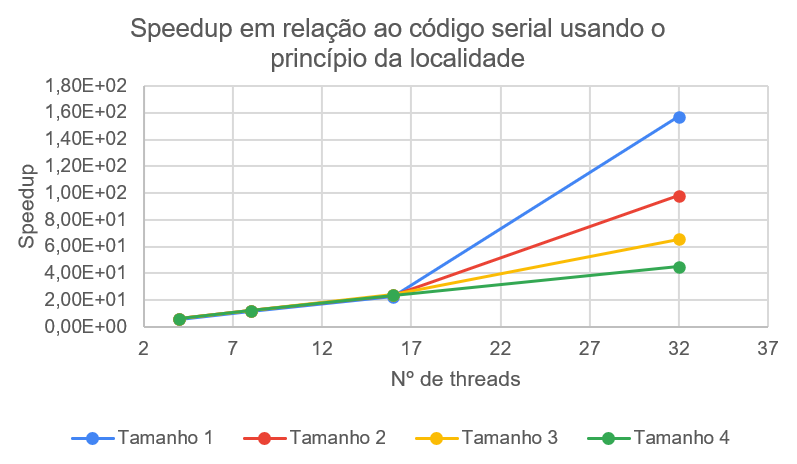

# Análise de Algoritmos Paralelos e Seriais

## Multiplicação de Matrizes

Universidade Federal do Rio Grande do Norte ([UFRN](http://http://www.ufrn.br)), 2020.

Análise por:

[Oziel Alves](https://github.com/ozielalves/)

Esta análise se encontra disponível em:

`https://github.com/ozielalves/prog-paralela/tree/master/Multz`

## Sumário

  - [Introdução](#introdução)
    - [Objetivos](#objetivos)
    - [Dependência](#dependência)
      - [G++ Compiler](#g-compiler)
    - [Compilação e Execução](#compilação-e-execução)
    - [Arquivo com Resultados](#arquivo-com-resultados)
    - [Condições de Testes](#condições-de-testes)
      - [Informações sobre a máquina utilizada](#informações-sobre-a-máquina-utilizada)
    - [Apresentação do Algoritmo](#apresentação-do-algoritmo)
      - [Multiplicação de Matrizes Quadradas](#multiplicação-de-matrizes-quadradas)
      - [**Código serial usando o princípio da localidade (01)**](#código-serial-usando-o-princípio-da-localidade-01)
      - [**Código serial com acesso de memória aleatório (02)**](#código-serial-com-acesso-de-memória-aleatório-02)
      - [**Código paralelo**](#código-paralelo)
  - [Desenvolvimento](#desenvolvimento)
    - [Corretude](#corretude)
    - [Gráficos](#gráficos)
    - [Análise de Speedup](#análise-de-speedup)
    - [Análise de Eficiência](#análise-de-eficiência)
  - [Conclusão](#conclusão)
    - [Considerações Finais](#considerações-finais)
    - [Softwares utilizados](#softwares-utilizados)

## Introdução

### Objetivos

Esta analise tem como propósito a avaliação do comportamento de códigos seriais e de um código paralelo referentes a implementação do algoritmo de **Multiplicação de matrizes**. Será destacado o speedud e a eficiência do código paralelo em relação a 2 códigos seriais, levando em consideração os tempos de execução e tamanhos de problema para composição dos resultados finais da análise. Os cenários irão simular a execução dos programas para 1 (serial), 4, 8, 16 e 32 threads, com 4 tamanhos de problema, definidos empiricamente com o objetivo de atingir o tempo mínimo de execução determinado pela [referência](https://github.com/ozielalves/prog-paralela/tree/master/referencia) desta análise para os limites do intervalo de tamanhos.

### Dependência

#### G++ Compiler

É necessário para a compilação dos programam, visto que são feitos em c++.

```bash
# Instalação no Ubuntu 20.04 LTS:
sudo apt-get install g++
```

### Compilação e Execução

Instalada a dependência, basta executar o shellscript determinado para a devida bateria de execuções na raiz do repositório:<br>
Serão realizadas **10 execuções** com **4 tamanhos de problema** , em **5 quantidades de threads** (1, 4, 8, 16 e 32).

```bash
# Para o algoritmo serial de multiplicação de matrizes usando o princípio da localidade
./multz1_serial_start.sh
```

```bash
# Para o algoritmo serial de multiplicação de matrizes com acesso de memória aleatório
./multz2_serial_start.sh
```

```bash
# Para o algoritmo paralelo de multiplicação de matrizes
./multz_paralelo_start.sh
```

**Obs.:** Caso seja necessário conceder permissão máxima para os scripts, execute `chmod 777 [NOME DO SCRIPT].sh`.

### Arquivo com Resultados

Após o termino das execuções do script é possível ter acesso aos arquivos de tempo `.txt` na pasta `serial` ou `paralelo`, de acordo com o script executado. Os resultantes da execução desses scripts foram utilizados para realização desta análise.

### Condições de Testes

#### Informações sobre a máquina utilizada

- **Supercomputador (UFRN) - Nó computacional em lâmina**

- **Processador**: 2 x CPU Intel Xeon Sixteen-Core E5-2698v3 de 2.3 GHz/40M cache/ 9.6 GT/s

- **Número de Cores/Threads**: 32/32

- **Memória**: 128 GB tipo DDR4 – 2133MHz RDIMM (8 x 16GB)

- **Sistema**: Centos 6.5 x86_64

### Apresentação do Algoritmo

#### Multiplicação de Matrizes Quadradas

O produto de duas matrizes é definido somente quando o número de colunas da primeira matriz é igual ao número de linhas da segunda matriz. Se a matriz `A` é uma matriz **m**×**n** e `B` é uma matriz **n**×**p**, então a matriz `produto` resultante da multiplicação de `A` por `B` é uma matriz **m**×**p**. O elemento de cada entrada da matriz `produto` é dado pelo produto da **i**-ésima linha de `A` com a **j**-ésima coluna de `B`, ou seja:


O algoritmo desenvolvido para esta análise realiza a multiplicação de matrizes **m**×**n**. A imagem abaixo representa de maneira intuitiva o procedimento de multiplicação de duas matrizes.


**Referência**: José Ruy, Giovanni (2002). Matemática fundamental: uma nova abordagem. São Paulo: FTD.

#### **Código serial usando o princípio da localidade (01)**

Dado um número `size` de tamanho de matriz para criação das matrizes quadradas, a seguinte sub-rotina é implementada:

1. A matriz `fator_a` é alocada com `size` linhas e colunas e inicializada com inteiros semi-randômicos.

2. Em seguida, a matriz `fator_b` é também inicializada a partir de uma cópia da matriz `fator_a` utilizando `memcpy`.

3. Feito isto, a matriz `produto` é também alocada com `size` linhas e colunas.

4. Após a fase de inicialização das matrizes é então chamada a função que realiza a multiplicação da matriz `fator_a` pela matriz `fator_b`.

A implementação da função `MULTZ` é apresentada abaixo:

```bash
# Multiplica duas matrizes contemplando o princípio da localidade
void MULTZ(int size, int **fator_a, int **fator_b, int **produto)
{
    int i, j, k;            # Variáveis auxiliares
    int row_start, row_end; # Inicio e fim da linha da matriz
    int sum;                # Armazena o produto da multiplicação

    row_start = 0;
    row_end = size;

    # Para cada linha na matriz "fator_a"
    for (i = row_start; i < row_end; i++)
    {
        # Para cada coluna na matriz "fator_b"
        for (j = 0; j < size; j++)
        {
            sum = 0;
            for (k = 0; k < size; k++)
            {
                sum += fator_a[i][k] * fator_b[k][j];
            }
            produto[i][j] = sum;
        }
    }
}
```

#### **Código serial com acesso de memória aleatório (02)**

Dado um número `size` de tamanho de matriz para criação das matrizes quadradas, uma rotina idêntica a anterior é implementada, a alteração está somente na implementação da função `MULTZ`:

```bash
# Multiplica duas matrizes não contemplando o princípio da
void MULTZ(int size, int **fator_a, int **fator_b, int **produto)
{
    int i, j, k;                           # Variáveis auxiliares
    vector<int> rows(size), columns(size); # Vetor de Linhas e de Colunas da matriz
    int sum = 0;                           # Armazena o produto da multiplicação

    # Populando vectors de linhas e colunas
    for (i = 0; i < size; i++)
    {
        rows[i] = i;
        columns[i] = i;
    }

    # Aleatorizando as linhas e colunas
    random_shuffle(rows.begin(), rows.end());
    random_shuffle(columns.begin(), columns.end());

    # Para cada linha na matriz "fator_a"
    for (i = 0; i < size; i++)
    {
        # Para cada coluna na matriz "fator_b"
        for (j = 0; j < size; j++)
        {
            sum = 0;
            for (k = 0; k < size; k++)
            {
                sum += fator_a[rows[i]][k] * fator_b[k][columns[j]];
            }
            produto[rows[i]][columns[j]] = sum;
        }
    }
}
```

#### **Código paralelo**

Ainda sendo `n` o número de elementos para criação de uma lista com inteiros randômicos, a seguinte sub-rotina é implementada:

Ainda sendo `size` o tamanho de matriz para criação das matrizes quadradas e `num_threads` o número de threads que serão utilizadas na execução do programa, a seguinte sub-rotina é implementada:

1. O vetor de threads é alocado de acordo com o número de threads `num_threads` fornecido.

2. As matrizes `fator_a`, `fator_b` e `produto` são alocadas com `size` linhas e colunas.

3. Em seguida, as matrizes `fator_a` e `fator_b` são inicializadas com inteiros semi-randômicos.

4. Após a fase de inicialização das matrizes é então iniciado o processo de multiplicação usando multithreading, a função chamada para cada thread é a `PTH_MULTZ` que irá realizar a multiplicação de uma fatia da matriz `fator_a` pela matriz `fator_b` em cada thread.

A implementação da função `PTH_MULTZ` é apresentada abaixo:

```bash
# Rotina da Thread.
# Cada thread realiza a multiplicação de uma fatia da matriz "fator_a".
void *PTH_MULTZ(void *arg)
{
  int i, j, k;            # Variáveis auxiliáres
  int thread_id;          # Thread ID
  int slice;              # Fatia de multiplicação de cada thread
  int row_start, row_end; # Inicio e fim da fatia
  long sum;               # Armazena o produto da multiplicação

  thread_id = *(int *)(arg); # Recebe o ID da thread alocada sequencialmente.
  slice = size / num_threads;
  row_start = thread_id * slice;
  row_end = (thread_id + 1) * slice;

  # Para cada linha na matriz "fator_a"
  for (i = row_start; i < row_end; ++i)
  {
    # Para cada coluna na matriz "fator_b"
    for (j = 0; j < size; ++j)
    {
      sum = 0;
      for (k = 0; k < size; ++k)
      {
        sum += fator_a[i][k] * fator_b[k][j];
      }
      produto[i][j] = sum;
    }
  }
}

```

**Obs.:** Note que o algoritmo paralelo utiliza o **princípio da localidade** também implementado no código serial 01

## Desenvolvimento

Para esta análise, serão realizadas **5 execuções** com tamanhos de problema **1.408**, **1.664**, **1.920** e **2.176** - definidos empiricamente de modo a atingir os limites mínimos determinados pela [referência](https://github.com/ozielalves/prog-paralela/tree/master/referencia) da análise - em **5 quantidades de threads** (1, 4, 8, 16 e 32). Se espera que a eficiência do algoritmo paralelo quanto à multiplicação das matrizes seja maior para um mesmo tamanho de problema quando se altera apenas o número de threads utilizadas. Uma descrição completa da máquina de testes pode ser encontrada no tópico [Condições de Testes](#condições-de-testes).

### Corretude

Para validar a corretude dos algoritmos implementados foi realizado um teste utilizando **6** como tamanho de problema para os 3 códigos:


Como é possível perceber nos prints, todos os códigos conseguem realizar corretamente a multiplicação das matrizes geradas.<br><br>

### Gráficos


Através do gráfico de tempos por problema para os códigos seriais, é possível observar que o código serial 1 consegue resolver o problema em um menor tempo para todos os tamanhos de problema quando comparado ao código serial 2. Isso acontece porque o Sistema de Memória tende a manter dados e instruções próximos aos que estão sendo executados no topo da Hierarquia de Memória, dessa forma vetores e matrizes são armazenados em sequência de acordo com seus índices. Por isso, ao utilizar o **Principio da Localidade Espacial**, o código serial 1 ganha vantagem em cima do código serial 2 - que acessa os índices das matrizes de forma aleatória - quando gasta um tempo bem menor para acessar os índices consecutivos das matrizes.<br><br>

Observe agora o gráfico que compara o tempo de execução por problema para cada número de threads utilizadas.


De maneira perceptível o código paralelo consegue diminuir o seu tempo de execução para todos os tamanhos de problema quando aumentado o número de threads utilizadas. Se o gráfico for comparado com o gráfico anterior também é possível identificar uma redução dramática no tempo de execução para a relação codigo paralelo - código serial, mesmo quando observado apenas o menor número de threads utilizadas no código paralelo (4).

### Análise de Speedup

É possível definir o _speedup_, quando da utilização de `n` threads, como sendo o tempo médio de execução no código serial dividido pelo tempo médio de execução para `n` threads em um dado tamanho de problema. Dessa forma, o speedup representa um aumento médio de velocidade na resolução dos problemas. No gráfico abaixo é possível perceber de maneira mais clara o que acontece com o speedup do código paralelo quando aumentado o número de threads em utilização.



A forma como as linhas do gráfico assumem um comportamento diferente a partir do uso de 16 threads demonstra a relação inversamente proporcional existente entre o tamanho do problema e o speedup relativo por quantidade de threads em execução. Ou seja, quanto mais próximo do número de threads for o tamanho da fatia de matriz que cada thread irá multiplicar, mais rápida será a execução do programa.<br><br>

Observe agora o speedup do código paralelo relativo ao código serial com acesso de memória aleatório:


O código paralelo consegue resultados em termos de performance ainda melhores dos que foram observados na comparação anterior. No entanto, chega a ser injusta a comparação destes códigos tendo em vista, primeiramente, o uso da estratégia de acesso a memória que coaduna com o princípio da localidade espacial, e de maneira secundária mas mais importante, o uso do paralelismo. A combinação destas implementações junto ao comportamento do código paralelo para tamanhos de fatia próximos ao número de threads em utilização - explicados anteriormente - traduz a disparidade demonstrada no gráfico.<br>

A tabela abaixo apresenta uma comparação mais detalhada do speedup relativo ao código serial utilizando o princípio da localidade espacial e ao código serial utilizando acesso de memória aleatório.

| Cores | Tamanho do Problema | Speedup (S01) | Speedup (S02) |
| ----- | ------------------- | ------------- | ------------- |
| 4     | 1408                | 5.87          | 1.33          |
| 4     | 1664                | 6.06          | 1.76          |
| 4     | 1920                | 6.16          | 2.30          |
| 4     | 2176                | 6.01          | 2.45          |
| 8     | 1408                | 1.16          | 2.63          |
| 8     | 1664                | 1.20          | 3.48          |
| 8     | 1920                | 1.21          | 4.53          |
| 8     | 2176                | 1.19          | 4.85          |
| 16    | 1408                | 2.25          | 5.12          |
| 16    | 1664                | 2.35          | 6.83          |
| 16    | 1920                | 2.39          | 8.90          |
| 16    | 2176                | 2.35          | 9.56          |
| 32    | 1408                | 1.57          | 6.41          |
| 32    | 1664                | 9.81          | 4.00          |
| 32    | 1920                | 6.55          | 2.67          |
| 32    | 2176                | 4.50          | 1.83          |

### Análise de Eficiência

Através do cálculo do speedup, é possível obter a eficiência do algoritmo quando submetido a execução com as diferentes quantidades de threads. Este cálculo pode ser realizado através da divisão do speedup do algoritmo utilizando `n` threads pelo número `n` de threads utilizados.


Observando as linhas que representam a eficiência para todas as quantidades de threads, é possível identificar uma manutenção da eficiência para um mesmo tamanho de problema conforme aumentamos somente o número de threads. Para **32 threads**, em especial, é possível identificar uma queda na eficiência conforme aumentado o tamanho do problema. Todavia, vale salientar o grande aumento da eficiência de maneira inversamente proporcional ao crescimento do problema para esta quantidade, para os 3 primeiros tamanhos de problema a eficiência em 32 threads ficou acima da média se comparada às demais quantidades de threads. Apesar da redução da eficiência para 32 threads conforme aumentado o tamanho do problema, a linha que representa esta quantidade de threads no gráfico tende a se estabilzar em valores bem próximos aos observados para as outras quantidades de threads. Em consequência disto, é possível definir o algoritmo paralelo como **fortemente escalável** quando comparado ao algoritmo serial que reproduz a mesma estratégia de acesso a memória na multiplicação.<br>

Observe agora o gráfico de eficiência do código paralelo em relação ao código serial que utiliza acesso de memória aleatório.


De maneira ainda mais surpreendente, na maioria dos casos, as linhas no gráfico são corrigidas positivamente em valor de eficiência à medida que aumenta o número de threads para um mesmo tamanho de problema. Este crescimento na eficiência pode ser observado até o uso de 16 threads, quando as linhas aparentam tender a um valor constante de eficiência. Assim como no gráfico anterior, a linha de eficiência para 32 threads também apresenta um comportamento peculiar. De todo modo, o encontro desta linha com as demais acontece na execução do problema de maior tamanho e tende a permanecer em um valor corrigido junto as demais. Por tanto, o código paralelo, quando baseado no algoritmo serial com utlização do acesso de memória de forma aleatória, pode ser classficiado como **fortemente escalável**.<br>

A tabela abaixo apresenta a eficiência calculada através dos valores de speedup anteriormente fornecidos.

| Cores | Tamanho do Problema | Eficiência (S01) | Eficiência (S02) |
| ----- | ------------------- | ---------------- | ---------------- |
| 4     | 1408                | 1.47             | 3.33             |
| 4     | 1664                | 1.52             | 4.40             |
| 4     | 1920                | 1.54             | 5.74             |
| 4     | 2176                | 1.50             | 6.12             |
| 8     | 1408                | 1.45             | 3.28             |
| 8     | 1664                | 1.50             | 4.35             |
| 8     | 1920                | 1.52             | 5.66             |
| 8     | 2176                | 1.49             | 6.06             |
| 16    | 1408                | 1.41             | 3.20             |
| 16    | 1664                | 1.47             | 4.27             |
| 16    | 1920                | 1.49             | 5.56             |
| 16    | 2176                | 1.47             | 5.98             |
| 32    | 1408                | 4.91             | 2.00             |
| 32    | 1664                | 3.06             | 1.25             |
| 32    | 1920                | 2.05             | 8.35             |
| 32    | 2176                | 1.41             | 5.73             |

**Obs.:** Os valores superlineares encontrados para eficiência do algoritmo paralelo podem ser explicados pela utilização de algoritmos seriais não ótimos.

## Conclusão

### Considerações Finais

Por meio dos resultados coletados após a execução de todos os códigos, foi possível obter resultados bastante satisfatórios quanto a comparação do algoritmo paralelo em relação aos dois algoritmos seriais. O código paralelo se mostrou ser mais do que eficiente quando comparado em performance geral jusnto aos dois seriais, o que já era esperado. No entanto, foram encontrados valores de eficiência superlineares, mesmo na comparação com o código serial que implementa a mesma estrátegia de acesso a memória. Isto denuncia a não otimização dos códigos seriais utilizados na análise. Apesar disso, foi interessante perceber a diferença no desempenho dos algoritmos seriais utilizando os diferentes tipos de acesso a memória, a exploração do **Princípio da localidade espacial** foi ponto chave na conquista de performance para o código serial 01. Além disso, o comportamento singular da linha de eficiência para 32 threads obsevado nos gráficos foi importante para destacar a relação inversamente proporcional que existe entre o tamanho do problema e o speedup para este caso específico. Por fim, diante do comportamento da eficiência do código paralelo quando aumentado o número de threads para um mesmo tamanho de problema, foi possível classificar o algoritmo paralelo como **fortemente escalável** em ambos os casos de comparação.

### Softwares utilizados

```bash
~$: g++ --version
g++ (Ubuntu 9.3.0-17ubuntu1~20.04) 9.3.0
Copyright (C) 2019 Free Software Foundation, Inc.
This is free software; see the source for copying conditions.  There is NO
warranty; not even for MERCHANTABILITY or FITNESS FOR A PARTICULAR PURPOSE.
```

```bash
~$: python3 --version
Python 3.8.5
```

```bash
~$: grip --version
Grip 4.5.2
```
