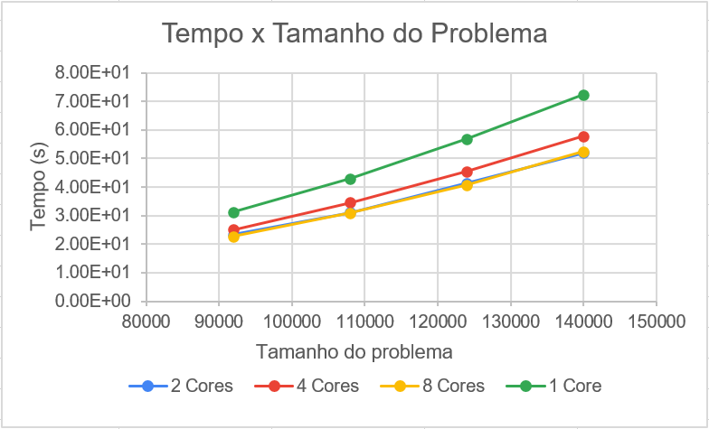
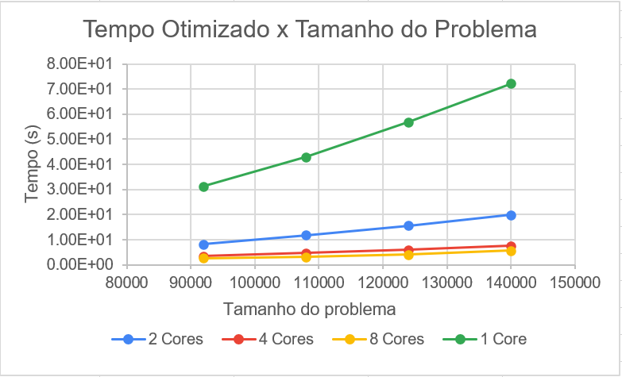
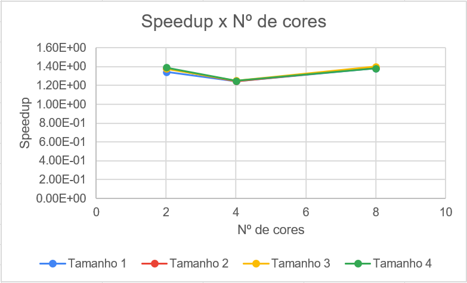
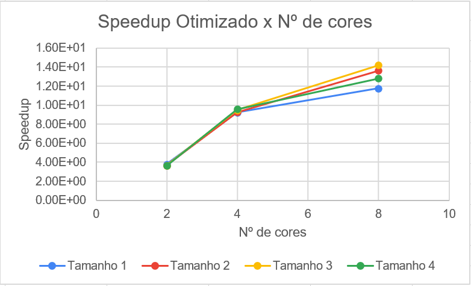
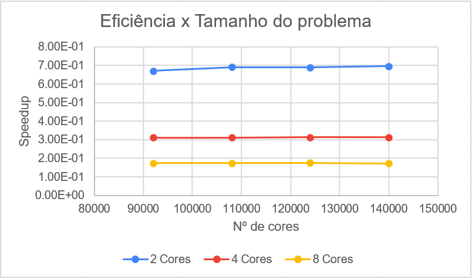
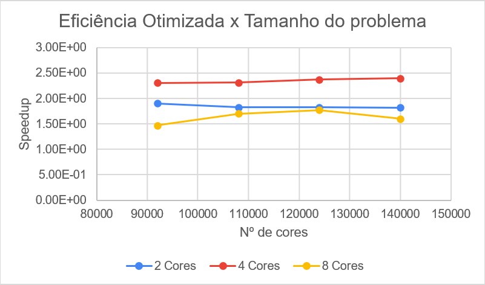

# Análise de Algoritmos Paralelos e Seriais
## Odd-Even Transposition Sort
Universidade Federal do Rio Grande do Norte ([UFRN](http://http://www.ufrn.br)), 2020.

#### Análise por:
- [Oziel Alves](https://github.com/ozielalves/)

## Sumário
+ [Introdução](#introdução)
  + [Objetivos](#objetivos)
  + [Dependências](#dependências)
    + [G++ Compiler](#g-compiler)
    + [MPI](#mpi---message-passing-interface)
  + [Compilação e Execução](#compilação-e-execução)
    + [Arquivo com Resultados](#arquivo-com-resultados)
    + [Condições de Testes](#condições-de-testes)
      + [Informações sobre a máquina utilizada](#informações-sobre-a-máquina-utilizada)
  + [Apresentação do Algoritmo](#apresentação-do-algoritmo)
    + [Odd-Even Transposition Sort](#odd-even-transposition-sort-1)
      + [Serial](#serial)
      + [Paralelo](#paralelo)
+ [Desenvolvimento](#desenvolvimento)      
  + [Corretude](#corretude)
  + [Gráficos](#gráficos)
  + [Serial e Paralelo - Tempo x Tamanho do Problema](#serial-e-paralelo---tempo-x-tamanho-do-problema)
  + [Tamanho do Problema - Tempo x Cores](tamanho-do-problema---tempo-x-cores)
  + [Análise de Speedup](#análise-de-speedup)
  + [Análise de Eficiência](#análise-de-eficiência)
+ [Conclusão](#conclusão)
  + [Considerações Finais](#considerações-finais)
  + [Softwares utilizados](#softwares-utilizados)

## Introdução

### Objetivos
Analisar e avaliar o comportamento, eficiência e speedup dos algoritmos em relação ao seu tempo de execução, tamanho do problema analisado e resultados obtidos. Os cenários irão simular a execução dos algoritmos para 1 (serial), 2, 4 e 8 cores, com 4 tamanhos de problema definidos empiricamente. Os limites de tamanhos foram estabelecidos com o objetivo de atingir o tempo mínimo de execução determinado pela [referência](https://github.com/ozielalves/prog-paralela/tree/master/referencia) desta Análise.

### Dependências
#### G++ Compiler
É necessário para a compilação dos programam, visto que são feitos em c++.
```bash
# Instalação no Ubuntu 20.04 LTS:
sudo apt-get install g++
```

#### MPI - Message Passing Interface
É necessário para a compilação e execução dos códigos paralelos.
```bash
# Instalação no Ubuntu 20.04 LTS:
sudo apt-get install -y mpi 
```
### Compilação e Execução
Instaladas as dependências, basta executar o shellcript determinado para a devida bateria de execuções na raiz do repositório:<br>
Serão realizadas **5 execuções** com **4 tamanhos de problema** , em **3 quantidades de cores** (2, 4 e 8).
```bash
# Para o algorítimo de ordenação serial
./OETS_serial_start.sh
```
```bash
# Para o algorítimo de ordenação paralelo
./OETS_paralelo_start.sh
```

**Obs.:** Caso seja necessário conceder permissão máxima para os scripts, execute `chmod 777 [NOME DO SCRIPT].sh`.

### Arquivo com Resultados 
Após o termino das execuções do script é possível ter acesso aos arquivos de tempo `.txt` na pasta `serial` ou `paralelo`, de acordo com o script executado. Os dados coletados foram utilizados para realização desta análise.

### Condições de Testes
#### Informações sobre a máquina utilizada
+ **Dell Inspiron 14-inc 7460**

+ **Processador**: Intel Core i7 7500U (até 3.5 GHz) Dual Core Cache 4M. (FSB)4 GT/s OPI (Integra HyperThreading para trabalhar com até 4 threads de uma vez)

+ **Número de Cores/Threads**: 2/4

+ **Memória**: 8 GB tipo DDR4 – 2133MHz

+ **Sistema**: Ubuntu 20.04.1 LTS


### Apresentação do Algoritmo

#### Odd-Even Transposition Sort


O algoritmo Odd-Even Transposition ordena n elementos em `n` fases (n é par), cada fase requer `n / 2` operações de troca de comparação. Esse algoritmo alterna entre duas fases, **Odd** (ímpares) e **Even** (pares). Seja `[a1, a2, ..., an]` uma lista a ser ordenada. Durante a fase Odd, os elementos com índices ímpares são comparados com seus vizinhos direitos e, se estiverem fora da sequência, são trocados; assim, os pares `(a 1, a2), (a3, a 4), ... , (an-1, an)` são trocados por comparação (assumindo que n é par). Da mesma forma, durante a fase Even, os elementos com índices pares são comparados com seus vizinhos direitos, e se eles estiverem fora de sequência, eles são trocados; assim, os pares `(a2, a3), (a4, a5), ... , (an-2, an-1)` são trocados por comparação. Após `n` fases de trocas Odd-Even, a lista é ordenada. Cada fase do algoritmo (Odd ou Even) requer comparações **`Q(n)`**, e há um total de n fases; assim, a complexidade sequencial é **`Q(n²)`**.<br><br>
**Referência**: Introduction to Parallel Computing-Ananth Gramma (2nd Edition)


#### Serial
Dado um número `n` de elementos para criação de uma lista com inteiros randômicos, a seguinte sub-rotina é implementada: 

1. `list` recebe `n` espaços de memória alocados referentes a lista a ser ordenada.

2. Em seguida, a função `genList` se responsabiliza por popular `list` com números inteiros pseudoaleatórios.

3. Feito isto, a função `oddEvenSort` pode dar início ao processo de ordenação de maneira análoga à descrição anterior.

4. Após o termino da ordenação, a memória alocada para `list` é liberada.

A implementação da função `oddEvenSort` é apresentada abaixo:
```bash
void oddEvenSort(int *list, int n) 
{ 
    bool isSorted = false; # Flag que indica se a lista está ordenada
  
    while (!isSorted) 
    { 
        isSorted = true; 
  
        # Fase ímpar (Odd)
        for (size_t i = 1; i <= n-2; i = i+2) 
        { 
            if (list[i] > list[i+1]) 
             { 
                swap(list[i], list[i+1]); 
                isSorted = false; 
              } 
        } 
  
        # Fase par (Even)
        for (size_t i = 0; i<=n-2; i=i+2) 
        { 
            if (list[i] > list[i+1]) 
            { 
                swap(list[i], list[i+1]); 
                isSorted = false; 
            } 
        } 
    } 
  
    return; 
} 
```

#### Paralelo
Ainda sendo `n` o número de elementos para criação de uma lista com inteiros randômicos, a seguinte sub-rotina é implementada:  

1. É iniciada a comunicação paralela.

1. em um processo similar ao que acontece no código serial, `list` recebe `n` espaços de memória alocados referentes a lista a ser ordenada.

2. Em seguida, a função `genList` se responsabiliza por popular `list` com números inteiros pseudoaleatórios.

3. Feito isto, é chamada a função `MPI_OETS` para destribuir as parcelas de lista igualmente entre os processos, utilizando `MPI_Scatter`, e ordenar as parcelas de lista em cada processo, usando a função `oddEvenSort` já implementada no código serial.

4. Feito isto, é dado início à etapa de comunicação e troca de dados entre os processos utilizando a dinâmica de fases **Odd-Even**. Para auxiliar este processo é então chamada a função `MPI_SWAP` para cada 2 processos que precisam realizar a comunicação, também passando como paramêtro a lista local referente ao processo que está enviando o dado.

5. Dentro da `MPI_SWAP`, as listas locais referentes ao processo remetente e ao processo destinatário são unidas usando a função `Join`. A lista `merged_list`, resultante da união, é então ordenada, utilizando novamente a função `oddEvenSort`, para que a menor e a maior parcela sejam redestribuidas aos processos em comunicação de acordo com a hierarquia entre eles.

6. Finalizado o processo de comunicação e Troca de dados entre os processos, as listas locais são reunidas na lista principal de forma ordenada usando `MPI_Gather`.

7. Após o termino da ordenação, a memória alocada para `list` é liberada.

8. A comunicação MPI é finalizada.

A implementação do Paralelismo é apresentada abaixo:
```bash
/*
 * Join nas duas listas locais (Ordem não preservada)
 * 
 * arg list_rcv: local_list_rcv
 * arg len_list_rcv: tamanho de local_list_rcv
 * arg list_snd: local_list_snd
 * arg len_list_snd: tamanho de local_list_snd
 * arg merged_list: lista auxiliar resultante 
 */

int Join(int *local_list_rcv, int len_local_list_rcv, int *local_list_snd,
          int len_local_list_snd, int *merged_list)
{
    int i, j = 0;
    int aux = 0;

    
    while (i < len_local_list_rcv)
    {
        merged_list[aux++] = local_list_snd[i++];
    }
    # Sem garantia de ordem
    while (j < len_local_list_snd)
    {
        merged_list[aux++] = local_list_snd[j++];
    }

    return 0;
}

/*
 * O rank remetente envia os dados para fazer o swap e aguarda o retorno. 
 * O rank destinatario recebe os dados, ordena o novo array e retorna 
 * a outra metade que cabe ao rank remetente.
 */
void MPI_SWAP(int local_n, int *local_list, int snd_rank, int rcv_rank, MPI_Comm comm)
{
    int my_rank;                  # Rank dos meus processos
    const int merge_id = 1;       # Identifica a comunicação
    const int sorted_id = 2;      # Identifica a comunicação
    int aux_list[local_n];        # Lista auxiliar cópia da lista local do rank remetente
    int merged_list[2 * local_n]; # Lista auxiliar oriunda do Merge(local_n_rcv, local_n_snd)

    MPI_Comm_rank(comm, &my_rank);

    # Na fase Odd da comunicação
    if (my_rank == snd_rank)
    {
        # A rotina é bloqueada até que o rank destinatario receba a o dado
        MPI_Send(local_list, local_n, MPI_INT, rcv_rank, merge_id, MPI_COMM_WORLD);
        # MPI Status nao necessario para esta rotina
        MPI_Recv(local_list, local_n, MPI_INT, rcv_rank, sorted_id, MPI_COMM_WORLD, MPI_STATUS_IGNORE);
    }
    else
    {
        # Recebe local_list referente ao rank remetente
        MPI_Recv(aux_list, local_n, MPI_INT, snd_rank, merge_id, MPI_COMM_WORLD, MPI_STATUS_IGNORE);

        # Uniao da local_list do rank destinatario com a local_list do rank remetente (aux_list)
        Join(local_list, local_n, aux_list, local_n, merged_list);
        
        # Ordenação pós join
        oddEvenSort(merged_list, 2 * local_n);

        int start = 0;
        int end = local_n;

        # Garante que o Maior elemento suba && Menor elemento desca
        if (my_rank < snd_rank)
        {
            start = local_n;
            end = 0;
        }
        else
        {
            # Nada
        }

        # Envia a parte que cabe ao rementente já ordenada, após o Merge
        MPI_Send(&(merged_list[start]), local_n, MPI_INT, snd_rank, sorted_id, MPI_COMM_WORLD);

        # Atualiza local_list
        for (int i = end; i < end + local_n; i++)
        {
            # O rank destinatario fica com os Maiores elementos
            local_list[i - end] = merged_list[i];
        }
    }
}

# Ordenação local seguida de comunicacao-swap
void MPI_OETS(int n, int *list, MPI_Comm comm)
{
    int my_rank, p, i;
    int root_rank = 0;
    int *local_list; # Lista local

    MPI_Comm_rank(comm, &my_rank);
    MPI_Comm_size(comm, &p);

    local_list = (int *)calloc(n / p, sizeof(int)); # Aloca e inicializa

    # Divide list em partes iguais "local_list" para cada processo
    MPI_Scatter(list, n / p, MPI_INT, local_list, n / p, MPI_INT, root_rank, comm);

    # Ordena a lista local
    oddEvenSort(local_list, n / p);

    # Permutação Odd - Even
    for (i = 1; i <= p; i++)
    {
        # Fase ímpar (Odd)
        if ((my_rank + i) % 2 == 0)
        {
            if (my_rank < p - 1)
            {
                MPI_SWAP(n / p, local_list, my_rank, my_rank + 1, comm);
            }
        }
        # Fase par (Even)
        else if (my_rank > 0)
        {
            MPI_SWAP(n / p, local_list, my_rank - 1, my_rank, comm);
        }
        else
        {
            # Nada
        }
    }

    # Reune cada local_list na lista principal agora de forma ordeanda
    MPI_Gather(local_list, n / p, MPI_INT, list, n / p, MPI_INT, root_rank, comm);
}
```

**Obs.**: Em uma tentativa de otimizar o algorítimo foi feita uma mudança na etapa 5 da sub-rotina implementada para a ordenação da lista, a função `Join`, utilizada nesta etapa, foi substituida pela função `Merge` que reliza a união das duas listas locais preservando a ordenação já existente nestas parcelas, o que descarta a necessidade de utilizar novamentea função `oddEvenSort`. Esta técnica tem como propósito a redução do tempo gasto em mais uma ordenação para cada comunicação realizada. A eficiência obtida a partir desta decisão serão analisados e comparados no ítem [desenvolvimento](#desenvolvimento). Observe abaixo a implementação da função `Merge`:

```
bash
/*
 * Merge nas duas listas locais de forma a preservar a ordenação
 * 
 * arg list_rcv: local_list_rcv
 * arg len_list_rcv: tamanho de local_list_rcv
 * arg list_snd: local_list_snd
 * arg len_list_snd: tamanho de local_list_snd
 * arg merged_list: lista auxiliar resultante 
 */

int Merge(int *local_list_rcv, int len_local_list_rcv, int *local_list_snd,
          int len_local_list_snd, int *merged_list)
{
    int i, j;
    int aux = 0;

    for (i = 0, j = 0; i < len_local_list_rcv; i++)
    {
        # Garantia de ordem
        while ((local_list_snd[j] < local_list_rcv[i]) && j < len_local_list_snd)
        {
            merged_list[aux++] = local_list_snd[j++];
        }
        merged_list[aux++] = local_list_rcv[i];
    }
    while (j < len_local_list_snd)
    {
        merged_list[aux++] = local_list_snd[j++];
    }

    return 0;
}
```

## Desenvolvimento

Para esta análise, serão realizadas **5 execuções** com tamanhos de problema 92.000, 108.000, 124.000 e 140.000 - definidos empiricamente de modo a atingir os limites mínimos determinados pela [referência](https://github.com/ozielalves/prog-paralela/tree/master/referencia) da análise - em **3 quantidades de cores** (2, 4 e 8). Se espera que a eficiência do algorítimo paralelo quanto à ordenação da lista seja maior para um mesmo tamanho de problema quando se altera apenas o número de cores. Uma descrição completa da máquina de testes pode ser encontrada no tópico [Condições de Testes](#condições-de-testes).

### Corretude

Para validar a corretude dos algoritmos implementados foi realizado um teste utilizando **15** como tamanho de problema para os dois códigos:


Como é possível perceber, ambos os códigos conseguem ordenar corretamente as lista gerada com seed única.<br><br>

### Gráficos



Através do gráfico de tempos por problema, é possível observar que o código paralelo é executado em um tempo menor que o código serial pois a reta relativa a este último apresenta um coefiente angular maior do que as relativas ao primeiro, o que indica que ao se aumentar o tamanho de problema no código serial o aumento em tempo de execução é proporcionalmente maior que o que seria observado no código paralelo. No entado, a utilização da ordenação na função `MPI_SWAP` acabou trazendo consequências visíveis conforme executamos o código para um número maior de cores.<br><br>

Observe agora um segundo gráfico de tempos considerando a execução do código paralelo utilizando a otimização implementada pela função `Merge` na comunicação entre os processos.



O tempo de execução para o código paralelo cai de maneira bastante considerável, note ainda que existe uma redução na velocidade conforme aumentamos o número de cores utilizados, como era esperado em um modelo ótimo. Isso acontece, em resumo, porque a conservação da ordenação garantida pela função `Merge` economiza eventuais comparações desnecessárias.

### Análise de Speedup
É possível definir o speedup, quando da utilização de n cores, como sendo o tempo médio de execução no código serial dividido pelo tempo médio de execução para n cores em um dado tamanho de problema. Dessa forma, o speedup representa um aumento médio de velocidade na resolução dos problemas. Perceba abaixo de maneira mais clara o que acontece com o speedup do código paralelo quando é preciso ordenar as parcelas de listas passadas a cada comunicação de processos.



Conforme foi mencionado anteriormente, perceba que a execução dos problemas em 4 cores levou um tempo maior quando comparada a utilização de 2 cores, e que o desempenho para 8 cores se mostrou similar ao desempenho para 2 cores, isto ocorre porque o código paralelo inicial realiza também a ordenação sempre que existe uma comunicação entre os processos.<br><br> 
 
Observe agora o speedup relativo ao cógio paralelo otimizado:
 


Existe um crescimento visível no speedup quando aumentamos o número de cores em execução, observe de maneira mais precisa que até o terceiro tamanho de problema o algorítmo demonstrou apresentar um maior speedup conforme aumentamos o tamanho do problema. No entando, para o 4º tamanho de problema o speedup reduz se comparado hierarquicamente aos demais na execução com 8 cores, por exemplo.

A tabela abaixo apresenta uma comapração do speedup entre o código paralelo inicial e o código paralelo otimizado, para cada tamanho de problema, por número de cores executados:

| Cores	| Tamanho do Problema	| Speedup Inicial	| Speedup Otimizado
| --- | --- | ---| --- |
| 2	| 92000	| 3.80	| 1.34 |
| 2	| 108000	| 3.65	| 1.38 |
| 2	| 124000	| 3.65	| 1.38 |
| 2	| 140000	| 3.64	| 1.39 |
| 4	| 92000	| 9.23	| 1.25 |
| 4	| 108000	| 9.26	| 1.24 |
| 4	| 124000	| 9.48	| 1.25 |
| 4	| 140000	| 9.57	| 1.25 |
| 8	|  92000	| 1.18	| 1.38 |
| 8	| 108000	| 1.36	| 1.39 |
| 8	| 124000	| 1.42	| 1.40 |
| 8	| 140000	| 1.28	| 1.38 |


### Análise de Eficiência
Através do cáculo do speedup, é possível obter a eficiência do algoritmo quando submetido a execução com as diferentes quantidades de cores. Este cálculo pode ser realizado através da divisão do speedup do algoritmo utilizando n cores pelos n cores utilizados. Como a máquina de testes possui apenas 2 cores físicos e implementa um hyper-threading para executar programas em 4 cores, para efeitos de análise comparativa iremos relacionar apenas estas duas quantidades. Porém, note que a eficiência de cores virtuais equivale a cerca de 30% da eficiência de cores físicos.



Se olharmos atentamente para a linha representa a eficiência para 2 cores é possível identificar uma mínima queda quando aumentamos pela primeria vez o tamanho do problema, no entanto, quando aumentamos mais uma vez o tamanho de problema, a linha volta a subir de maneira a permanecer praticamente estável para o próximo tamanho de problema. Já a linha que representa a eficiência para 4 cores se aproxima visivelmente de uma reta, o que índica uma constância na eficiência se aumentando o tamanho do problema na mesma proporção em que o número de cores. Desse modo, é possível definir o algoritmo analisado como **fracamente escalável**.<br>



Apesar dos limites da máquina de testes, a eficiência média reduz de maneira considerável se compararmos o passo no uso de 2 para 4 cores, isso acontece porque aumentar a quantidade de cores utilizados gera mais comunicação, o que implica em uma maior distância em relaçao a eficiência linear. A tabela abaixo apresenta a eficiência média calculada através dos valores de speedup médio anteriormente mencionados.

| Número de Cores | 2 | 4 | 8 |
| --- | --- | ---| --- |
|**Eficiência Média**|0.90|0.61|0.30| 

## Conclusão

### Considerações Finais

Devido aos limites da máquina de testes, o número de cores passíveis de utilização é restrito. Das análises apresentadas, fica explicito que 4 cores é o limite do dispositivo junto a implementação do Hyper-threading, de  maneira a obter ainda um speedup relevante, não sendo possível estender o número de cores utilizados para 8. Apesar disto, através desta análise foi possível perceber que a paralelização de códigos seriais, ainda que simples, traz resultados bastante promissores no que diz respeito a eficiência e velocidade. Além disto, também foi permitido constatar que o speedup é ainda mais pronunciado para tamanhos maiores de problema. No entando, isto não quer dizer necessáriamente que o algoritmo tenha uma boa escalabiliade.

### Softwares utilizados
```bash
~$: g++ --version
g++ (Ubuntu 9.3.0-17ubuntu1~20.04) 9.3.0
Copyright (C) 2019 Free Software Foundation, Inc.
This is free software; see the source for copying conditions.  There is NO
warranty; not even for MERCHANTABILITY or FITNESS FOR A PARTICULAR PURPOSE.
```

```bash
~$: python3 --version
Python 3.6.4
```

```bash
~$: grip --version
Grip 4.2.0 
```
