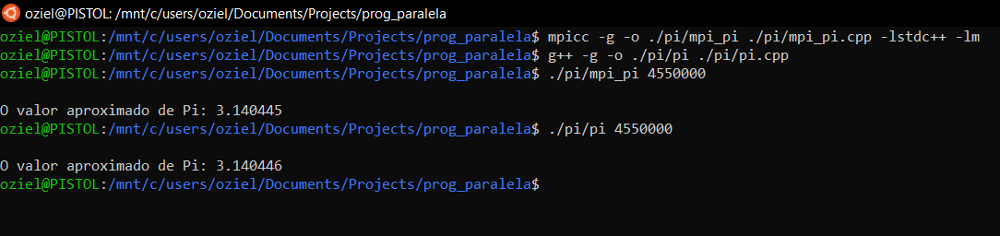
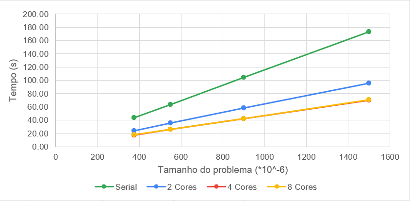

# Análise de Algoritmos Paralelos e Seriais
Universidade Federal do Rio Grande do Norte ([UFRN](http://http://www.ufrn.br)), 2020.

#### Análise por:
- [Oziel Alves](https://github.com/ozielalves/)

## Sumário

+ [Objetivos](#objetivos)
+ [Dependências](#dependências)
  + [G++ Compiler](#g-compiler)
  + [MPI](#mpi---message-passing-interface)
+ [Compilação e Execução](#compilação-e-execução)
  + [Arquivo com Resultados](#arquivo-com-resultados)
+ [Apresentação dos Algoritmos](#apresentação-dos-algoritmos)
  + [Cálculo do Pi](#cálculo-do-pi---método-de-monte-carlo)
    + [Serial](#serial)
    + [Paralelo](#paralelo)
+ [Resultados - Análise de Eficiência](#resultados---análise-de-eficiência)
  + [Corretude](#corretude)
+ [Análise de Speedup](#cálculo-do-pi---análise-de-speedup)
  + [Serial e Paralelo - Tempo x Tamanho do Problema](#serial-e-paralelo---tempo-x-tamanho-do-problema)
  + [Paralelo - Tempo x Cores](#paralelo---tempo-x-cores)
+ [Condições de Testes](#condições-de-testes)
  + [Informações sobre a máquina utilizada](#informações-sobre-a-máquina-utilizada)
  + [Softwares utilizados](#softwares-utilizados)

## Objetivos
Analisar e avaliar o comportamento, eficienência e speedup dos algoritmos em relação ao seu tempo de execução, tamanho do problema e resultados obtidos. Os cenários irão simular a execução dos algoritmos para 2, 4 e 8 cores, no caso dos algorótimos paralelos, com alguns tamanhos de problema definidos empiricamente, sendo o menor tamanho estabelecido no objetivo até atingir o tempo mínimo de execução determinado pela referência da Análise (30 segundos).

## Dependências
#### G++ Compiler
É necessário para a compilação do programa, visto que ele é feito em c++.
```bash
# Instalação no Ubuntu 20.04 LTS:
sudo apt-get install g++
```
#### MPI - Message Passing Interface
É necessário para a compilação e execução dos códigos paralelos.
```bash
# Instalação no Ubuntu 20.04 LTS:
sudo apt-get install -y mpi 
```
### Compilação e Execução
Instaladas as dependências, basta executar o shellcript determinado para a devida bateria de execuções na raiz do repositório:<br>
Note que serão realizados **5 execuções** com **4 tamanhos de problema** , em **3 quantidades de cores** (2, 4 e 8).
```bash
# Para o algorítimo que calcula o pi de forma serial
./pi_serial_start.sh
```
```bash
# Para o algorítimo que calcula o pi de forma paralela
./pi_paralelo_start.sh
```
**Obs.:** Caso seja necessário conceder permissão máxima para os scripts, execute `chmod 777 [NOME DO SCRIPT].sh`.
### Arquivo com Resultados 
Após o termino das execuções do script é possível ter acesso aos arquivos `.txt` na pasta `pi`, os dados coletados foram utilizados para realização desta análise.

## Apresentação dos Algoritmos

### Cálculo do Pi - Método de Monte Carlo
O algorítimo é baseado no método Monte Carlo para estimar o valor de **`𝜋`**. O método de Monte Carlo depende de amostragem independente e aleatória repetida, ele funciona bem com sistemas paralelos e distribuídos, pois o trabalho pode ser dividido entre vários processos. Sua ideia principal é simular um grande número de realizações de um evento estatístico. Neste sentido, o uso de multiplos processadores permite a realização de um número fixo de eventos por processador, o que aumenta o número total de eventos simulados.<br> 
No cálculo de Pi, em específico, o algorítimo implementado tem como base a geração de diversos pontos cujas coordenadas são números aleatórios com função de desnsidade de probabilildade constante num intervalo indo de 0 a 1. Assim, a probabilidadede que os pontos estejam dentro do quadrado definido pelo produto cartesiano [0,1]x[0,1] é unitária. Se, de todos os pontos gerados, contarmos aqueles cuja norma euclidiana é menor ou igual a 1 é possível encontrar a probabilidade de que um ponto esteja dentro do quarto de círculo centrado na origem de raio 1, que é proporcional a sua área. Com isso, e sabendo a área de 1/4 de círculo basta uma manipulação algébrica para encontrar o valor de pi aproximado. Assim:

```bash
   pi = 4 * (pontos_dentro_do_círculo)/(pontos_totais)
```

#### Serial
Dado um número de pontos a serem definidos, que iremos apelidar como `termos`, a seguinte sub-rotina é implementada. 

1. É setado o valor `acertos` = 0.0.

2. `termos` determinará a quatidade de pontos `x` e `y` a serem definidos randomicamente com seed fixa = 42, dentro do intervalo de 0.0 a 1.0.

3. Caso `( x * x + y * y )` seja menor que 1.0, `acertos` é acrescido em 1 unidade.

4. Ao termino do laço, para conclusão do método de Monte Carlo,  é retornado `acertos` multiplicado por 4 e dividido por `termos`.

A implementação da função calcPi é apresentada abaixo:
```bash
double calcPi(int termos)
{
    # Gerador Mersene twist, SEED: 42
    mt19937 mt(42);
    
    # Numero real pseudo-aleatorio
    uniform_real_distribution<double> linear_r(0.f, 1.f);

    int acertos = 0;
    for (int i = 0; i < termos; i++)
    {

        double x = linear_r(mt);
        double y = linear_r(mt);
        
        if (x * x + y * y < 1.0)
        {
            acertos++;
        }
    }
    return (double)(4.0 * acertos / termos);
}
```

#### Paralelo
Ainda referente a pontos a serem definidos como `termos`, a seguinte sub-rotina é implementada.  

1. O tamanho do problema `termos` é lido por por linha de comando.

2. É iniciada a comunicação paralela.

3. `termos_local` recebe `termos` dividido pela quantidade de processos.

4.  `termos_local` é passado como parametro pra o cáculo parcial dos acertos, usando a função já apresentada `calcPi`, e armazenado em cada processo como `acertos_parc`.

5. Ao termino da execução de cada processo , `acertos_parc` é somado a `acertos`.

6. Quando todos os processos são finalizados, é fechada a comunicalçao MPI e então impresso o valor do resultado final multiplicado por 4 e dividido por `termos`.

**Obs.:** Vale salientar que, por escolha particular, a multiplicação e divisão realizada no número de acertos foi realizada apenas na impressão do resultado, diferente do que acontece naturalmente da função `calcPi`, no código paralelo é retornado apenas a quantidade de acertos.

A implementação do Paralelismo é apresentado abaixo:
```bash
int main(int argc, char **argv)
{
    struct timeval start, stop;
    gettimeofday(&start, 0);

    int my_rank;
    int p;
    int termos = atoll(argv[1]);
    int termos_local;
    int inicial_local;
    double acertos_parc;
    double acertos;

    MPI_Init(&argc, &argv);

    // Rank do meu processo
    MPI_Comm_rank(MPI_COMM_WORLD, &my_rank);

    // Descobre quantos processos estao em uso
    MPI_Comm_size(MPI_COMM_WORLD, &p);

    // Divisao interna
    termos_local = termos / p;

    // Bloqueia o processo até todos chegarem nesse ponto
    MPI_Barrier(MPI_COMM_WORLD);

    acertos_parc = calcPi(termos_local);

    // Soma o numero de acertos por cada processo
    MPI_Reduce(&acertos_parc, &acertos, 1, MPI_DOUBLE, MPI_SUM, 0, MPI_COMM_WORLD);
    if (my_rank == 0)
    {
        gettimeofday(&stop, 0);

        FILE *fp;
        char outputFilename[] = "./pi/tempo_mpi_pi.txt";

        fp = fopen(outputFilename, "a");
        if (fp == NULL)
        {
            fprintf(stderr, "Nao foi possivel abrir o arquivo %s!\n", outputFilename);
            exit(1);
        }

        fprintf(fp, "\tTempo: %1.2e \tResultado: %f\n",
                ((double)(stop.tv_usec - start.tv_usec) / 1000000 + (double)(stop.tv_sec - start.tv_sec)),
                (double)4 * acertos / termos);

        fclose(fp);
    }
    else
    { /* Nothing */ }

    MPI_Finalize();
}
```

## Resultados - Análise de Eficiência
Para esta análise, serão realizados **5 execuções** com os tamanhos de problema 374.500.000, 550.000.000, 900.000.000 e 1.500.000.000 - definidos empiricamente de modo a atingir os limites mínimos determinados pela referência - em **3 quantidades de cores** (2, 4 e 8). Se espera que o comportamento de ambos os algorítimos quanto realização da aproximação do Pi correta e coerente de acordo com um tamanho de problema, a descrição completa da máquina de testes pode ser encontrada no tópico [Condições de Testes](#condições-de-testes).

### Corretude

Para validar a corretude dos Algorítimos implementados foi realizado um teste utilizando **4550000** como tamanho de problema para os dois códigos:



Como é possível perceber, ambos os códigos conseguem aproximar de maneira correta o valor de pi, dado o número de pontos solicitados.<br><br>
**Obs.:** Vale salientar que para este modelo de amostragem quanto maior o número de pontos a serem definidos mais preciso será o valor de pi retornado.

## Cálculo do Pi - Análise de Speedup

### Serial e Paralelo - Tempo x Tamanho do Problema



Através do gráfico comparativo é possível observar uma diferença significantemente positiva no tempo de execução para os tamanhos de problemas no código serial para tempo de execução dos mesmos problemas no código paralelo, o menor problema é executado em pouco mais de 40 segundo no código serial, já no código paralelo, o mesmo problema é executado em pouco menos de 20 segundos em seu maior uso de cores. No entanto, note que a diferença em termos de tempo de execução para o código paralelo utilizando 4 e 8 cores é praticamente inexistente devido aos limites da máquina de teste.

### Paralelo - Tempo x Cores


No gráfico de comparação dos tempos de execução por tamanho de problema, a relação speedup pode ser melhor visualizada de acordo com o número de cores, Note que o tempo de execução para o problema de maior tamanho cai cerca de 80% quando executado no código paralelo ultilizando 2 cores.

### Speedup por Número de cores
Ao coletar os dados das diferentes análises, o tempo médio de execução do código serial para cada tamanho de problema foi dividido pelo mesmo valor relativo a cada problema executado no código paralelo, obtendo assim o speedup para cada tamanho de problema. É possível ver na tabela abaixo o speedup médio geral por número de cores utilizados na execução do código paralelo.
| Número de Cores | 2 | 4 | 8 |
| --- | --- | ---| --- |
|**Speedup Médio**|1.80|2.47|2.44| 

## Considerações Finais

Devido aos limites da máquina de testes não foi possível estender o número de cores utilizados, ficou muito bastante explicito 4 cores como o limite de cores a serem utilizados pelo dispositivo de maneira a trazer um speedup relevante. Apesar disto, através desta análise foi possível perceber que a paralelização de códigos seriais, ainda que simples, trás resultados bastante promissores no que diz respeito a eficiência e velocidade, se faz pertinente também visualizar o aumento do speedup de maneira ainda mais considerável quando o tamanho do problema é aumentado. 

## Condições de Testes
### Informações sobre a máquina utilizada
+ **Dell Inspiron 14-inc 7460**

+ **Processador**: Intel Core i7 7500U (até 3.5 GHz) Dual Core Cache 4M. (FSB)4 GT/s OPI (
Integra HyperThreading para trabalhar com até 4 threads de uma vez)

+ **Número de Cores/Threads**: 2/4

+ **Memória**: 8 GB tipo DDR4 – 2133MHz

+ **Sistema**: Ubuntu 20.04.1 LTS

### Softwares utilizados
```bash
~$: g++ --version
g++ (Ubuntu 9.3.0-17ubuntu1~20.04) 9.3.0
Copyright (C) 2019 Free Software Foundation, Inc.
This is free software; see the source for copying conditions.  There is NO
warranty; not even for MERCHANTABILITY or FITNESS FOR A PARTICULAR PURPOSE.
```

```bash
~$: python3 --version
Python 3.6.4
```

```bash
~$: pip3 --version
pip 9.0.1 from /usr/local/lib/python3.6/site-packages (python 3.6)
```
