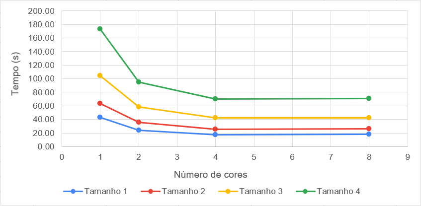
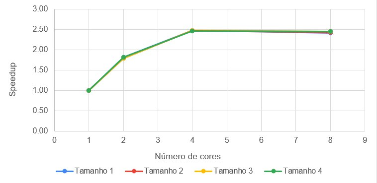
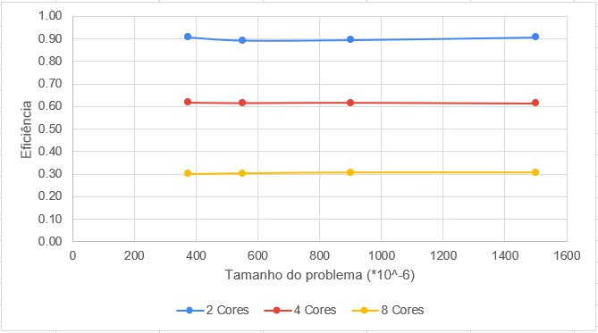
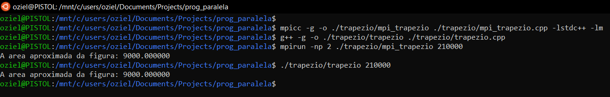
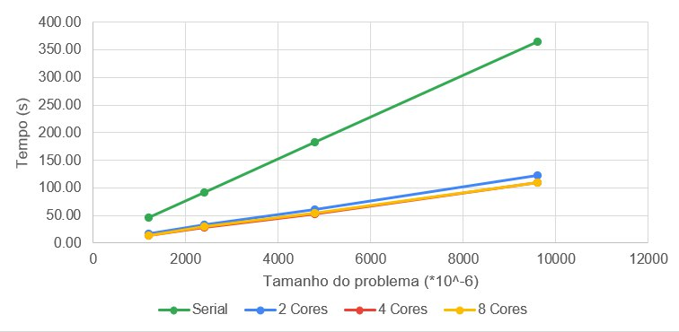
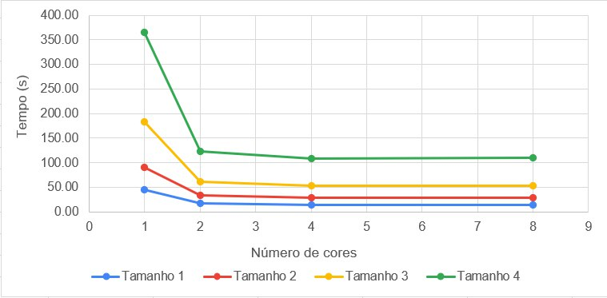
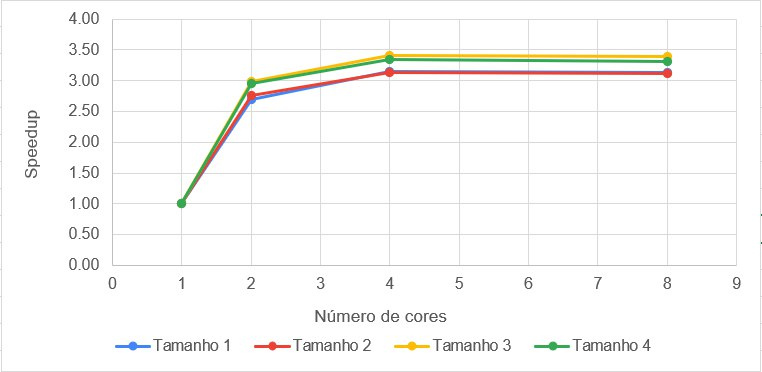
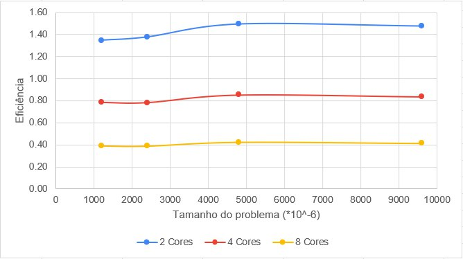

# Análise de Algoritmos Paralelos e Seriais
Universidade Federal do Rio Grande do Norte ([UFRN](http://http://www.ufrn.br)), 2020.

#### Análise por:
- [Oziel Alves](https://github.com/ozielalves/)

## Sumário
+ [Introdução](#introdução)
  + [Objetivos](#objetivos)
  + [Dependências](#dependências)
    + [G++ Compiler](#g-compiler)
    + [MPI](#mpi---message-passing-interface)
  + [Compilação e Execução](#compilação-e-execução)
    + [Arquivo com Resultados](#arquivo-com-resultados)
    + [Condições de Testes](#condições-de-testes)
      + [Informações sobre a máquina utilizada](#informações-sobre-a-máquina-utilizada)
  + [Apresentação dos Algoritmos](#apresentação-dos-algoritmos)
    + [Cálculo do Pi](#cálculo-do-pi---método-de-monte-carlo)
      + [Serial](#serial)
      + [Paralelo](#paralelo
    + [Cálculo da Integral - Regra do Trapézio](#cálculo-da-integral---regra-do-trapézio)
      + [Serial](#serial)
      + [Paralelo](#paralelo)
+ [Desenvolvimento](#desenvolvimento)      
  + [Resultados](#resultados)
    + [Cálculo do Pi](#cálculo-do-pi)
      + [Corretude](#corretude)
      + [Gráficos](#gráficos)
      + [Serial e Paralelo - Tempo x Tamanho do Problema](#serial-e-paralelo---tempo-x-tamanho-do-problema)
      + [Paralelo - Tempo x Cores](#paralelo---tempo-x-cores)
      + [Análise de Speedup](#análise-de-speedup)
      + [Análise de Eficiência](#análise-de-eficiência)
    + [Cálculo da Integral](#cálculo-da-integral)
      + [Corretude](#corretude)
      + [Gráficos](#gráficos)
      + [Serial e Paralelo - Tempo x Tamanho do Problema](#serial-e-paralelo---tempo-x-tamanho-do-problema)
      + [Paralelo - Tempo x Cores](#execução-do-problema---tempo-x-cores)
      + [Análise de Speedup](#análise-de-speedup)
      + [Análise de Eficiência](#análise-de-eficiência)
+ [Conclusão](#conclusão)
  + [Considerações Finais](#considerações-finais)
  + [Softwares utilizados](#softwares-utilizados)

## Introdução

### Objetivos
Analisar e avaliar o comportamento, eficiência e speedup dos algoritmos em relação ao seu tempo de execução, tamanho do problema analisado e resultados obtidos. Os cenários irão simular a execução dos algoritmos para 2, 4 e 8 cores, no caso dos algoritmos paralelos, com alguns tamanhos de problema definidos empiricamente, sendo o menor tamanho estabelecido com o objetivo de atingir o tempo mínimo de execução determinado pela referência da Análise (30 segundos).

### Dependências
#### G++ Compiler
É necessário para a compilação dos programam, visto que são feitos em c++.
```bash
# Instalação no Ubuntu 20.04 LTS:
sudo apt-get install g++
```
<br>
<br>
<br>

#### MPI - Message Passing Interface
É necessário para a compilação e execução dos códigos paralelos.
```bash
# Instalação no Ubuntu 20.04 LTS:
sudo apt-get install -y mpi 
```
### Compilação e Execução
Instaladas as dependências, basta executar o shellcript determinado para a devida bateria de execuções na raiz do repositório:<br>
Serão realizadas **5 execuções** com **4 tamanhos de problema** , em **3 quantidades de cores** (2, 4 e 8).
```bash
# Para o algorítimo que calcula o pi de forma serial
./pi_serial_start.sh
```
```bash
# Para o algorítimo que calcula o pi de forma paralela
./pi_paralelo_start.sh
```
```bash
# Para o algorítimo que calcula o pi de forma serial
./trapezio_serial_start.sh
```
```bash
# Para o algorítimo que calcula o pi de forma paralela
./trapezio_paralelo_start.sh
```

**Obs.:** Caso seja necessário conceder permissão máxima para os scripts, execute `chmod 777 [NOME DO SCRIPT].sh`.

### Arquivo com Resultados 
Após o termino das execuções do script é possível ter acesso aos arquivos `.txt` na pasta `pi` ou `trapezio`, de acordo com o script executado. Os dados coletados foram utilizados para realização desta análise.

### Condições de Testes
#### Informações sobre a máquina utilizada
+ **Dell Inspiron 14-inc 7460**

+ **Processador**: Intel Core i7 7500U (até 3.5 GHz) Dual Core Cache 4M. (FSB)4 GT/s OPI (Integra HyperThreading para trabalhar com até 4 threads de uma vez)

+ **Número de Cores/Threads**: 2/4

+ **Memória**: 8 GB tipo DDR4 – 2133MHz

+ **Sistema**: Ubuntu 20.04.1 LTS

## Desenvolvimento

### Apresentação dos Algoritmos

#### Cálculo do Pi - Método de Monte Carlo
O algoritmo é baseado no método de Monte Carlo para estimar o valor de **`𝜋`**. Ele depende de amostragem independente e aleatória repetida, e funciona bem com sistemas paralelos e distribuídos, pois o trabalho pode ser dividido entre vários processos. Sua ideia principal é simular um grande número de realizações de um evento estatístico. Neste sentido, o uso de multiplos processadores permite a realização de um número fixo de eventos por processador, o que aumenta o número total de eventos simulados.<br> 
No cálculo de Pi, em específico, o algoritmo implementado tem como base a geração de diversos pontos, cujas coordenadas são números aleatórios com função de desnsidade de probabilildade constante em um intervalo indo de 0 a 1. Assim, a probabilidadede que os pontos estejam dentro do quadrado definido pelo produto cartesiano [0,1]x[0,1] é unitária. Se, de todos os pontos gerados, contarmos aqueles cuja norma euclidiana é menor ou igual a 1, é possível encontrar a probabilidade de que um ponto esteja dentro do quarto de círculo centrado na origem e de raio 1, que é proporcional a sua área. Com isso, e sabendo a área de 1/4 de círculo, basta uma manipulação algébrica para encontrar o valor de pi aproximado. Assim:

```bash
   pi = 4 * (pontos_dentro_do_círculo)/(pontos_totais)
```

#### Serial
Dado um número de pontos a serem definidos, que chamaremos de `termos`, a seguinte sub-rotina é implementada: 

1. É setado o valor `acertos` = 0.0.

2. `termos` determinará a quatidade de pontos `x` e `y` a serem definidos randomicamente com seed fixa = 42, dentro do intervalo de 0.0 a 1.0.

3. Caso `( x * x + y * y )` seja menor que 1.0, `acertos` é acrescido em 1 unidade.

4. Ao termino do laço, para conclusão do método de Monte Carlo,  é retornado `acertos` multiplicado por 4 e dividido por `termos`.

A implementação da função `calcPi` é apresentada abaixo:
```bash
double calcPi(int termos)
{
    # Gerador Mersene twist, SEED: 42
    mt19937 mt(42);
    
    # Numero real pseudo-aleatorio
    uniform_real_distribution<double> linear_r(0.f, 1.f);

    int acertos = 0;
    for (int i = 0; i < termos; i++)
    {

        double x = linear_r(mt);
        double y = linear_r(mt);
        
        if (x * x + y * y < 1.0)
        {
            acertos++;
        }
    }
    return (double)(4.0 * acertos / termos);
}
```

#### Paralelo
Ainda chamando o numero total de pontos a serem definidos como `termos`, a seguinte sub-rotina é implementada:  

1. O tamanho do problema, `termos` é lido por por linha de comando.

2. É iniciada a comunicação paralela.

3. `termos_local` recebe `termos` dividido pela quantidade de processos.

4.  `termos_local` é passado como parametro para o cáculo parcial dos acertos, usando a função já apresentada, `calcPi`, e armazenado em cada processo como `acertos_parc`.

5. Ao termino da execução de cada processo , `acertos_parc` é somado a `acertos`.

6. Quando todos os processos finalizam a contagem de acertos, todos os acertos parciais são somados a `acertos`, então, é fechada a comunicação MPI e impresso o valor do resultado final multiplicado por 4 e dividido por `termos`.

**Obs.:** Vale salientar que, por escolha particular, a multiplicação e divisão no número de acertos foi realizada apenas na impressão do resultado. Diferentemente do que acontece naturalmente na função `calcPi`, no código paralelo é retornado apenas a quantidade de acertos.

A implementação do Paralelismo é apresentada abaixo:
```bash
int main(int argc, char **argv)
{
    struct timeval start, stop;
    gettimeofday(&start, 0);

    int my_rank;
    int p;
    int termos = atoll(argv[1]);
    int termos_local;
    int inicial_local;
    double acertos_parc;
    double acertos;

    MPI_Init(&argc, &argv);

    # Rank do meu processo
    MPI_Comm_rank(MPI_COMM_WORLD, &my_rank);

    # Descobre quantos processos estao em uso
    MPI_Comm_size(MPI_COMM_WORLD, &p);

    # Divisao interna
    termos_local = termos / p;

    # Bloqueia o processo até todos chegarem nesse ponto
    MPI_Barrier(MPI_COMM_WORLD);

    acertos_parc = calcPi(termos_local);

    # Soma o numero de acertos por cada processo
    MPI_Reduce(&acertos_parc, &acertos, 1, MPI_DOUBLE, MPI_SUM, 0, MPI_COMM_WORLD);
    if (my_rank == 0)
    {
        gettimeofday(&stop, 0);

        FILE *fp;
        char outputFilename[] = "./pi/tempo_mpi_pi.txt";

        fp = fopen(outputFilename, "a");
        if (fp == NULL)
        {
            fprintf(stderr, "Nao foi possivel abrir o arquivo %s!\n", outputFilename);
            exit(1);
        }

        fprintf(fp, "\tTempo: %1.2e \tResultado: %f\n",
                ((double)(stop.tv_usec - start.tv_usec) / 1000000 + (double)(stop.tv_sec - start.tv_sec)),
                (double)4 * acertos / termos);

        fclose(fp);
    }
    else
    { /* Nothing */ }

    MPI_Finalize();
}
```

### Cálculo da Integral - Regra do Trapézio
A regra do trapézio é um método para aproximar a integral de uma função, `y = f (x)`, usando trapézios para calcular a área. O processo é simples. Sejam `xa` e `xb` os pontos que limitam o intervalo para ser feito o cálculo da integral, e seja `n` o número de sub-intervalos de `xa` até `xb`. Para cada sub-intervalo, a função é aproximada com uma linha reta entre os valores da função em ambas as extremidades do sub-intervalo. Cada sub-intervalo agora é um mini-trapézio. Por último, a área de cada mini-trapézio é calculada e todas as áreas são somadas para obter uma aproximação da integral da função `f` de `xa` a `xb`. Assim:


#### Serial
Dado um `n`, tal que representa o número de mini-trapézios a dividir o intervalo, a seguinte sub-rotina é implementada: 

1. É setado o intervalo `xa` = 0.0 `xb`= 30.0 na função `main`.

2. É realizada então a chamada da função `trapezioIntegral` passando como parâmetros `xa`, `xb` e `n`.

3. O valor da base de cada mini-trapézio no intervalo é definido pela substração de `xb` por `xa` divido por `n`, chamaremos de `inc`.
  
4. O valor da `area_total` recebe inicialmente `(f(xa) + f(xb)) / 2`.

5. Sendo `x_i` o passo do x de um sub-intervalo a outro, em um laço de `x_1` até `x_n-1` os valores de `f(x_i)` são acrescidos a `area_total`.

6. Ao termino do laço, para conclusão do cáculo da integral pela regra do trapézio, `area_total` é multiplicada por `inc` e retornada pela função.

A implementação da função `trapezioIntegral` é apresentada abaixo:
```bash
double trapezioIntegral(double xa, double xb, long long int n)
{
    double x_i;             # Passo do X
    double area_total = 0.; # Soma das areas
    double inc;             # Incremento

    inc = (xb - xa) / n;
    area_total = (f(xa) + f(xb)) / 2;

    for (long long int i = 1; i < n; i++)
    {
        x_i = xa + i * inc;
        area_total += f(x_i);
    }

    area_total = inc * area_total;

    return area_total;
}
```

#### Paralelo
Para implementação da regrado do trapézio de modo paralelo, é preciso primeiro identificar as tarefas necessárias e mapear as tarefas para todos os processos. Sendo assim, é preciso: 
1. Encontrar a área de muitos trapézios individuais, o retorno destas áreas parciais serão atribuidos localmente à `area_relativa`.
2. Somar essas áreas, a soma total será atribuida à `area_total`.

Intuitivamente, conforme aumentamos o número de trapézios, receberemos uma previsão mais precisa da integral calculada. Assim, estaremos usando mais trapézios do que cores neste problema, é preciso dividir os cálculos para calcular as áreas dos mini-trapézios. O procedimento será realizado atribuindo a cada processo um subintervalo que contém o número de trapézios, obtidos a partir do cálculo do número total de trapézios `n`, dividido pelo número de processos. Isso pressupõe que o número total de trapézios é igualmente divisível pelo número de processos. Cada processo aplicará a regra do trapézio ao seu subintervalo. Por último, o processo mestre soma as estimativas.

<br>
Dado um `n`, tal que representa o número de trapézios a dividir o intervalo, a seguinte sub-rotina é implementada:  

1. É iniciada a comunicação paralela.

2. `n` é passado como argumento para a função auxiliar `setSize` junto ao rank do processo, `my_rank`, para destribuir o tamanho do problema para todos os processos usando `MPI_Bcast`.

3. O incremento é calculado pela divisão por `n` do resultado da subtração de `xb` por `xa`.

4. O número de trapézios a ser calculados por cada processo, `local_n`, é definido através da divisão de `n` pelo númeor de processos, `p`.

5. Cada processo calcula a `area_relativa` ao seu intervalo.

6. Quando todos os processos finalizam o cáculo da integral de seus respectivos intervalos, o valor de cada integral parcial é somado a `area_total`, então,  é fechada a comunicação MPI.

A implementação do Paralelismo é apresentada abaixo:
```bash
int main(int argc, char **argv)
{
    struct timeval start, stop; # Intervalo de tempo calculado ao fim
    gettimeofday(&start, 0);

    int my_rank = 0;           # Rank do meu processo
    int p = 0;                 # Numero de processos
    const double xa = 0.;      # X Início da figura
    const double xb = 30.;     # X Fim da figura
    double n = 0.;             # Numero de mini trapezios
    double inc = 0.;           # Incremento (Base do Trapezio)
    double local_a = 0.;       # X Início da figura LOCAL
    double local_b = 0.;       # X Fim da figura LOCAL
    long long int local_n = 0; # Numero de mini trapezios LOCAL

    double area_relativa = 0.; # Area relativa ao intervalo
    double area_total = 0.;    # Area total

    MPI_Init(&argc, &argv);

    # Rank do processo
    MPI_Comm_rank(MPI_COMM_WORLD, &my_rank);

    # Quantos processos então sendo usados
    MPI_Comm_size(MPI_COMM_WORLD, &p);

    # Destribui o valor de n para todos os processos
    setSize(argc, argv, my_rank, &n);

    # O incremento e local_n serão os mesmo para todos os processos
    inc = (xb - xa) / n;
    local_n = n / p;

    # O tamanho de cada intervalo de processo será (local_n * inc)
    local_a = xa + my_rank * (local_n * inc);
    local_b = local_a + (local_n * inc);

    # Bloqueia o processo até todos chegarem nesse ponto
    MPI_Barrier(MPI_COMM_WORLD);

    area_relativa = trapezioIntegral(local_a, local_b, local_n);

    # Soma as integrais calculadas por cada processo
    MPI_Reduce(&area_relativa, &area_total, 1, MPI_DOUBLE, MPI_SUM, 0, MPI_COMM_WORLD);

    if (my_rank == 0)
    {
        gettimeofday(&stop, 0);

        FILE *fp;
        char outputFilename[] = "./trapezio/tempo_mpi_trapezio.txt";

        fp = fopen(outputFilename, "a");
        if (fp == NULL)
        {
            fprintf(stderr, "Nao foi possivel abrir o arquivo %s!\n", outputFilename);
            exit(1);
        }

        fprintf(fp, "\tTempo: %1.2e \tResultado: %f\n", 
        ((double)(stop.tv_usec - start.tv_usec) / 1000000 + (double)(stop.tv_sec - start.tv_sec)),
        area_total);

        fclose(fp);
    }
    else
    { /* Nothing */ }

    MPI_Finalize();
}
```

## Resultados
### Cálculo do Pi
Para esta análise, serão realizadas **5 execuções** com tamanhos de problema 374.500.000, 550.000.000, 900.000.000 e 1.500.000.000 - definidos empiricamente de modo a atingir os limites mínimos determinados pela [referência](https://github.com/ozielalves/prog-paralela/tree/master/referencia) - em **3 quantidades de cores** (2, 4 e 8). Se espera que o comportamento de ambos os algoritmos quanto a aproximação do Pi seja parecido para um mesmo tamanho de problema quando se altera apenas o número de cores, sendo o tempo de execução o único fator variável. Uma descrição completa da máquina de testes pode ser encontrada no tópico [Condições de Testes](#condições-de-testes).

#### Corretude

Para validar a corretude dos algoritmos implementados foi realizado um teste utilizando **4.550.000** como tamanho de problema para os dois códigos:


Como é possível perceber, ambos os códigos conseguem aproximar de maneira correta o valor de pi, dado o número de pontos solicitados.<br><br>
**Obs.:** Vale salientar que para este modelo de amostragem quanto maior o número de pontos a serem definidos mais preciso será o valor de pi retornado.


#### Gráficos

##### Serial e Paralelo - Tempo x Tamanho do Problema


Através do gráfico comparativo, é possível observar que o código paralelo é mais eficiente que o código serial pois a reta relativa a este último apresenta um coefiente angular maior do que as relativas ao primeiro, o que indica que ao se aumentar o temanho de problema no código serial o aumento em tempo de execução é proporcionalmente maior que o que seria observado no código paralelo. Vale salientar que as curvas referentes a 4 e 8 cores são praticamente idênticas, isso ocorre devido aos limites da máquina de teste, fenômeno que será mais bem explicado no item [Considerações Finais](#considerções-finais).

##### Tamanho do Problema - Tempo x Cores



A partir do gráfico apresentado, é clara a influência do número de cores no tempo de execução. Note que, por exemplo, o tempo de execução para o problema de maior tamanho cai cerca de 45% ao se passar do código serial para o código paralelo ultilizando 2 cores. Novamente, verifica-se que o desempenho para 4 e 8 cores é idêntico.


#### Análise de Speedup
É possível definir o speedup, quando da utilização de n cores, como sendo o tempo de execução no código serial dividido pelo tempo médio de execução para n cores em um dado tamanho de problema. Dessa forma, o speedup representa um aumento médio de velocidade na resolução dos problemas. Sabendo que o limite de cores/threads da máquina de testes é 4, é esperado que o espeedup médio da execução dos probelmas para 4 e 8 cores seja aproximadamente idêntico.

### Speedup x Número de Cores Utilizados



((((((((((((((((((TODO

A tabela abaixo apresenta o speedup médio por número de cores após 5 tentativas de execução dos 4 problemas descritos neste item.

| Número de Cores | 2 | 4 | 8 |
| --- | --- | ---| --- |
|**Speedup Médio**|1.80|2.47|2.44| 

#### Análise de Eficiência
Através do cáculo do speedup, é possível obter a eficiência do algoritmo quando submetido a execução com as diferentes quantidades de cores. Este cálculo pode ser realizado através da divisão do speedup do algoritmo utilizando n cores pelos n cores utilizados.

### Eficiêcia x Tamanhos do Problema



((((((((((((TODO))))))))))))

Desse modo, após o cáculo da eficiência, é possível definir o algoritmo analisado como **fracamente escalável**, isto é, quando o valor da eficiência reduz conforme aumentamos o número de cores utilizados. Apesar dos limites da máquina de testes, a eficiência reduz de maneira considerável se compararmos o passo no uso de 2 para 4 cores. A tabela abaixo apresenta a eficiência média calculada através dos valores de speedup anteriormente mencionados.

OBS.: Colocar mais processos gera mais comunicação, o que implica em uma maior distância em relaçao a eficiência linear

| Número de Cores | 2 | 4 | 8 |
| --- | --- | ---| --- |
|**Eficiência Média**|0.90|0.61|0.30| 

#### Cálculo da Integral
Para esta análise, serão realizadas **5 execuções** com tamanhos de problema 1.200.000.000, 2.400.000.000, 4.800.000.000 e 9.600.000.000, intervalo no eixo X de 0.0 a 30.0, e função a ser integrada definida como `f(x) = pow(x, 2)` - ambos definidos empiricamente de modo a atingir os limites mínimos determinados pela [referência](https://github.com/ozielalves/prog-paralela/blob/master/referencia/Regras_do_trabalho_MPI_1.pdf) - em **3 quantidades de cores** (2, 4 e 8). Se espera que o comportamento de ambos os algoritmos quanto ao cálculo da integral seja idêntico para um mesmo tamanho de problema quando se altera apenas o número de cores, sendo o tempo de execução o único fator variável. Uma descrição completa da máquina de testes pode ser encontrada no tópico [Condições de Testes](#condições-de-testes).

#### Corretude

Para validar a corretude dos algoritmos implementados foi realizado um teste utilizando **210.000** como tamanho de problema para os dois códigos:



Como é possível perceber nas impressões, ambos os códigos conseguem aproximar de maneira correta o valor da integral de `f(x) = pow(x, 2)` de 0.0 até 30.0, dado o número de trapézios solicitados.<br><br>
**Obs.:** Vale salientar que para este modelo de amostragem quanto maior o número de trapézios mais precisa será a integral da função no intervalo selecionado.

#### Gráficos

##### Serial e Paralelo - Tempo x Tamanho do Problema



Através do gráfico comparativo, é possível observar que o código paralelo é mais eficiente que o código serial pois a reta relativa a este último apresenta um coefiente angular maior do que as relativas ao primeiro, o que indica que ao se aumentar o tamanho de problema no código serial o aumento em tempo de execução é proporcionalmente maior que o observado no código paralelo. Note que a redução no tempo de execução do código paralelo para o código serial orcorre de maneira proporcional ao tamanho dos problemas. Vale salientar que as curvas referentes a 4 e 8 cores são praticamente idênticas, isso ocorre devido aos limites da máquina de teste, fenômeno que será mais bem explicado no item [Considerações Finais](#considerções-finais).

##### Execução do Problema - Tempo x Cores



A partir do gráfico apresentado, é clara a influência do número de cores no tempo de execução. Por exemplo, o tempo de execução para o problema de maior tamanho no código serial cai para cerca de 8% ao se passar para o código paralelo ultilizando 4 cores. Novamente, verifica-se que o desempenho para 4 e 8 cores é idêntico.

#### Análise de Speedup
É possível definir o speedup, quando da utilização de n cores, como sendo o tempo de execução no código serial dividido pelo tempo médio de execução para n cores em um dado tamanho de problema. Dessa forma, o speedup representa um aumento médio de velocidade na resolução dos problemas.

### Speedup x Número de Cores Utilizados



((((((((((((((((((TODO

A tabela abaixo apresenta o speedup médio por número de cores após 5 tentativas de execução dos 4 problemas descritos neste item.

| Número de Cores | 2 | 4 | 8 |
| --- | --- | ---| --- |
|**Speedup Médio**|2.85|3.26|3.41| 

#### Análise de Eficiência
Através do cáculo do speedup, é possível obter a eficiência do algoritmo quando submetido a execução com as diferentes quantidades de cores. Este cálculo pode ser realizado através da divisão do speedup do algoritmo utilizando n cores pelos n cores utilizados. 

### Eficiêcia x Tamanhos do Problema



((((((((((((TODO))))))))))))

Desse modo, após o cáculo da eficiência, é possível definir o algoritmo analisado como de **baixa escalabilidade**, isto é, quando o valor da eficiência reduz conforme aumentamos o número de cores utilizados. A tabela abaixo apresenta a eficiência média calculada através dos valores de speedup anteriormente mencionados.

| Número de Cores | 2 | 4 | 8 |
| --- | --- | ---| --- |
|**Eficiência Média**|1.42|0.81|0.42|

## Conclusão

### Considerações Finais

Devido aos limites da máquina de testes, o número de cores passíveis de utilização é restrito. Das análises apresentadas, fica explicito que 4 cores é o limite do dispositivo de maneira a ter um speedup relevante, apesar do processador integrar HyperThreading não foi possível estender o número de cores utilizados para 8. Apesar disto, através desta análise foi possível perceber que a paralelização de códigos seriais, ainda que simples, traz resultados bastante promissores no que diz respeito a eficiência e velocidade. Além disto, também foi permitido constatar que o speedup é ainda mais pronunciado para tamanhos maiores de problema. No entando, isto não quer dizer necessáriamente que o algoritmo tenha uma boa escalabiliade.

### Softwares utilizados
```bash
~$: g++ --version
g++ (Ubuntu 9.3.0-17ubuntu1~20.04) 9.3.0
Copyright (C) 2019 Free Software Foundation, Inc.
This is free software; see the source for copying conditions.  There is NO
warranty; not even for MERCHANTABILITY or FITNESS FOR A PARTICULAR PURPOSE.
```

```bash
~$: python3 --version
Python 3.6.4
```

```bash
~$: grip --version
Grip 4.2.0 
```
